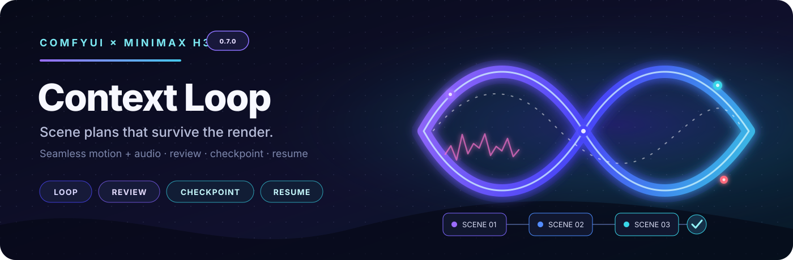

<p align="center">
  
</p>

# ComfyUI MiniMax H3 Context Loop

Build a multi-scene MiniMax H3 video with one reusable sampling graph. Every
scene can be reviewed, retried, checkpointed, resumed, and assembled later.

**[Start here](docs/GETTING_STARTED.md)** ·
**[Node guide](docs/NODE_REFERENCE.md)** ·
**[Choose a workflow](example_workflows/README.md)** ·
**[All documentation](docs/README.md)**

> **0.7.0:** the tested nightly/RC is now the stable release on `main`.
> See the [release summary](RELEASE_NOTES_0_7.md),
> [shareable improvements table](docs/0.7-major-improvements.md),
> [migration notes](docs/MIGRATING_TO_0_7.md), and
> [validation record](docs/RELEASING_0_7.md). Back up workflows and projects before updating.
> The Registry package ID retains its historical `contex-loop` spelling for compatibility.

## What this pack does

- Groups full mix, vocals and instrumental tracks: vocals drive lip-sync while
  the full mix stays the soundtrack, with a per-scene On/Off control.
- Runs one scene at a time through the same H3 sampler body.
- Carries visual motion, generated sound, or protected source audio between
  scenes according to a simple Generation Profile.
- Saves each accepted take to disk, so a stopped or failed run can resume.
  See [cancellation and scene-level resume](docs/processing-resume.md) for
  DeRoPE/upscale checkpoints and recoverable VIDEO PNG publication.
- Provides scene review, alternate takes, branch management, final assembly,
  masked editing, and deferred upscaling.
- Captures a frame from a saved Review Gate preview into the Project Asset
  Carousel as a new tagged picture, without replacing the original take.

Models are not included.

### Context Loop execution and recovery

- **Context brush.** In Plan Studio → Context → Picture, use
  **Weaken context…** to paint fixed regions that may change more under AV Mask.
  [Usage and limits](docs/CONTEXT_WEAKEN_MASK.md).
- **Optional top-level requeue.** Examples use recursive execution by default.
  For a separate prompt boundary between accepted scenes, enable top-level
  requeue in Loop End and ComfyUI settings. See
  [execution modes](docs/MAINTAINED_WORKFLOW.md) for setup and limits.
- **Reference propagation fix.** Valid prompt `@tags` again see the connected
  Tagged registry during preflight without rewriting prompt text or storing
  reference data in the Plan.
- **Crash-safe review and resume.** Review snapshots stay visible after a
  refresh or restart, and durable handoffs/manual resume keep the same Plan
  semantics while avoiding duplicate queues.
- **Migration guidance.** The original Plan remains supported. Removed legacy
  nodes and controls are listed in the [0.7 migration guide](docs/MIGRATING_TO_0_7.md).

## Install

From `ComfyUI/custom_nodes`:

```bash
git clone https://github.com/seitanism/ComfyUI-H3-Motion-Context-MultiRef.git
git clone --branch main \
  https://github.com/ethanfel/ComfyUI-MiniMaxH3-Context-Loop.git
```

Restart ComfyUI after cloning or updating either pack. A current ComfyUI build
with native **Add Guide for MiniMax H3** support is recommended. `ffmpeg` on
`PATH` gives the best review and assembly support; ComfyUI's PyAV is used as a
fallback where supported.

The MultiRef pack provides the maintained public Motion Context node. Context
Loop uses it automatically for compatible Guide scenes and keeps its own
specialized fallback for loop-only modes.

## Make your first video

1. Open [T2V Normal](<example_workflows/T2V Normal - MiniMax H3 0.6.json>) in
   ComfyUI.
2. Select the H3 diffusion model, text encoder, video VAE, and audio VAE.
3. In **Plan**, give the run a unique `run_name` and edit the scene prompts.
4. Keep the workflow's default visual continuity and generated-audio settings.
5. Queue the workflow. **Preflight** checks the plan before the models load.
6. At **Review Gate**, choose **Approve & continue**, **Retry**, **Reroll seed**,
   or **Approve & stop**.
7. The active **Assemble** node writes the final MP4 after the last scene.

To extend a running Plan, append scenes before approving its last scene. With
Loop Start's `scene_range` left blank, **Approve & continue** finishes the current
run, then queues the updated workflow at the first appended scene using the
saved checkpoint. Keep that workflow and branch open until it queues. Explicit
scene ranges and **Approve & stop** do not automatically extend the run.

To reuse a still as a reference, scrub the saved Review Gate preview, click
**Capture frame…**, check the destination project and tag, then **Save to
Carousel**. Reusing a tag creates a numbered take. Capture requires `ffmpeg`
and follows the destination project's workflow-ownership rules.

For a screen-by-screen explanation, expected output paths, and common first-run
problems, use the [Getting started guide](docs/GETTING_STARTED.md).

For disposable batch renders, Assemble has an opt-in
[`delete_checkpoints_after_assembly`](docs/POST_EXPORT_CHECKPOINT_CLEANUP.md)
setting. It frees checkpoint space only after a completed export. Leave it off
if you need resume, latent upscale, or checkpoint-based reassembly later.

## Choose a workflow

| I want to… | Open this workflow |
|---|---|
| Start simply with reference pictures | [Ref2V Basic](<example_workflows/Ref2V Basic - MiniMax H3 0.6.json>) — direct image loaders |
| Manage project references, scenes and optional source audio | [Carousel / Studio](<example_workflows/Ref2V Studio - MiniMax H3 0.6.json>) |
| Generate from text | [T2V Normal](<example_workflows/T2V Normal - MiniMax H3 0.6.json>) |
| Animate an opening image | [I2V Normal](<example_workflows/I2V Normal - MiniMax H3 0.6.json>) |
| Move from a first image to a last image | [FL2V Normal](<example_workflows/FL2V Normal - MiniMax H3 0.6.json>) |
| Inpaint part of a video | [Masked Video Inpaint](<example_workflows/Masked Video Inpaint - MiniMax H3 0.6.json>) |
| Continue an existing clip | [Masked AV Extension — Single Clip](<example_workflows/Masked AV Extension - Single Clip - MiniMax H3 0.6.json>) |
| Continue a reviewed chain | [Masked AV Extension — Chain](<example_workflows/Masked AV Extension - Chain + Reference Image - MiniMax H3 0.6.json>) |
| Generate the gap between two clips | [Two-Clip Masked AV Bridge](<example_workflows/Masked AV Bridge - Two Clips - MiniMax H3 0.6.json>) |
| Upscale a saved run | [Deferred upscale workflows](example_workflows/README.md#deferred-de-rope-and-upscale) |

Prefer explicit reference-loader wiring? The [manual Tagged examples](example_workflows/tagged/README.md)
are available separately. For SelfLift, use the [Seed Hunt example](<example_workflows/Ref2V Studio SelfLift Seed Hunt - EXPERIMENTAL - MiniMax H3 0.6.json>)
with review enabled or disabled.

The **0.7 release** uses the maintained **0.6-named workflow catalog**, rebuilt for
this checkout's nodes. Choose **Normal** for Production Plan and Scene Prompt
Editor. **Studio** adds Plan Studio, Project Asset Carousel, the rich prompt
editor, and Checkpoint Manager; it does not change the generation graph.
Pre-0.6 examples were retired in 0.7 and remain available in Git history.
See [0.7 migration notes](docs/MIGRATING_TO_0_7.md).

## How the graph is organized

<p align="center">
  
</p>

Only the current scene enters the sampling body. **Loop End** either starts the
next scene or emits a manifest for **Assemble**.

The supplied generation workflows also contain a muted recovery branch:

- **Muted** nodes are present but do not execute. The grey dashed **Load
  Manifest → Assemble later** pair is intentionally muted during normal runs.
- **Bypassed** nodes pass a compatible input through without applying their
  normal operation. Some optional attention nodes in upscale examples ship
  bypassed intentionally.
- To assemble an existing run without rendering, unmute the recovery pair and
  queue its **Assemble** node. No sampler graph needs to run.

The diagrams use the same idea as a disabled-pack node preview: sockets remain
visible so you can understand the wiring even when the node does not execute.
See [How disabled nodes are shown](docs/NODE_REFERENCE.md#how-disabled-nodes-are-shown).

## Core nodes

| Node | Main input | Main output | Use it for |
|---|---|---|---|
| **Generation Profile** | Continuity and audio choices | `chain_policy` | Choose normal behavior in two controls. |
| **Plan (Modern)** | Scene prompts, organized settings, required policy | `plan` | Define the production without legacy fallback controls. The original Plan remains available for existing workflows. |
| **Preflight** | `plan` | checked `plan`, `ready`, `status` | Catch problems before model loading. |
| **Loop Start** | checked `plan` | `flow`, `state` | Start or resume a run. |
| **Current Shot** | `state` | prompt, seed, timing, size | Drive the current scene. |
| **Chain Context** | state, conditioning, VAE, latent | conditioned latent and trim count | Add the selected continuity. |
| **Segment + Checkpoint** | state, frames, sampled latent | `segment` | Save a take and its resume state. |
| **Pending Review** | one defer toggle | `pending_review` | Optionally store a complete candidate batch for later review without leaving an execution waiting. |
| **Review Gate** | state and saved segment | reviewed `segment` | Approve, retry, reroll, or stop. |
| **Loop End** | flow, state, frames, latent, segment | `manifest` | Advance or finish the loop. |
| **Chapter Delivery** | manifest and Export current chapter toggle | scoped `manifest` | On exports the chapter containing the last generated scene, including unfinished chapters. Off exports everything in the incoming manifest. Automatically follows new chapters. Review Gate's **Approve & Stop** partial export follows the connected toggle too. |
| **Assemble** | `manifest` | `video_path` | Build the final MP4. |

The [Node guide](docs/NODE_REFERENCE.md) lists the important sockets, settings,
reference nodes, recovery tools, masking nodes, and advanced groups.

## Dialogue audio for one scene

In Plan Studio, select a scene and choose **Lip-sync source · this scene only**.
Pick an audio file from the Project Asset Carousel (use **Refresh audio** after
importing it). This turns that scene's Lip-sync on. The file can remain disabled
for prompt tags; it does not need to become the project's Source track.

**Audio file start** selects the position heard at the first delivered frame,
snapped to 1/24 second. AV context remains before that position. Short audio is
padded with silence and longer audio is cut to the scene; scene timing and other
scenes' sources do not change. Editorial trims/slips move dialogue with the picture.

With a Source final soundtrack, choose dialogue over the project track (default)
or replace the track during this scene. Generated output uses the dialogue once;
None remains muted. Source, offset and mix choice are saved with the generated
take and retained for checkpoint recovery, chapter delivery and upscale export.
Keep the carousel audio file: saved exports reference that original asset.
The player previews the current Plan selection through its Source track / scene
dialogue monitor; regenerate the scene after changing its dialogue source.
Choose **Inherit project timeline** to return to the existing source behavior.
Existing workflows without a scene source keep their previous behavior.

## Important behavior

- **Collapsible Studio chapters.** Use **▾** beside a chapter title to
  fold its scenes into a compact group. Click the group to play/scrub the chapter
  on a local timeline, including trims, ALTs and internal black gaps. Folding is
  saved with the workflow and does not alter generation or exports.
  See [chapter folding and playback](docs/PLAN_STUDIO_CHAPTERS.md).
- **Chapter resolution.** Click a chapter marker in Plan Studio, then
  choose **Inherit from Plan** or set its **Width / Height** (multiples of 32).
  Connect **Current Shot** width/height to the H3 conditioning node. A locked
  saved scene pins its entire chapter to its original size; changing the Plan
  default can then affect Chapter 2 without changing Chapter 1. Unlock the saved
  scenes before explicitly changing their chapter's size. Existing media is not
  resized. Native AV/latent video context cannot cross different sizes: use zero
  video context at that boundary. Export different-sized chapters separately
  through **Chapter Delivery**; mixed-resolution whole-run assembly is rejected.
- `run_name` identifies a production and its checkpoint history. Use a new name
  for a new production; keep it unchanged to resume.
- Preflight rejects incompatible resume state instead of mixing checkpoints
  produced with different generation inputs.
- Accepted scene media, manifests, and recovery data live under
  `ComfyUI/output/h3_chains/<run_name>/`.
- Uploaded project assets live under `ComfyUI/input/h3_projects/<run_name>/` and
  are mirrored into the run for recovery.
- Browser-driven asset imports are confined to media listed from ComfyUI
  input, another project, or an H3 recovery backup. Move other server files
  into the configured ComfyUI input directory before importing them.
- Direct prompt optimization allows OpenAI, Gemini, and OpenRouter by default.
  A server operator can add exact provider origins, including a local API,
  before startup with a comma-separated
  `H3_PROMPT_OPTIMIZER_ALLOWED_ORIGINS` value such as
  `http://127.0.0.1:1234,https://api.example.com`.
- New projects put scene MP4s in `generation/clips/` and assembled videos in
  `exports/videos/<scope>/`. Existing projects keep their original paths,
  including `final/`. **Assemble** can also copy to the regular ComfyUI output
  folder. See [simple layout and optional copy conversion](docs/SIMPLE_CHAIN_LAYOUT.md).
- The exact saved checkpoint supplies the next scene's continuity. Preview or
  assembly filters never rewrite that checkpoint.
- Plan Studio can render a picture-only **Alternate final-cut take** without
  changing downstream scene ancestry or audio. See [Runs and
  recovery](docs/RUNS_AND_RECOVERY.md#alternate-final-cut-takes).

## Documentation

| Task | Guide |
|---|---|
| Install and render the first scene | [Getting started](docs/GETTING_STARTED.md) |
| Understand nodes and sockets | [Node guide](docs/NODE_REFERENCE.md) |
| Pick an example | [Workflow catalog](example_workflows/README.md) |
| Manage a project's media library | [Project Asset Carousel](docs/PROJECT_ASSETS.md) |
| Write scenes and prompts | [Scene authoring](docs/SCENE_AUTHORING.md) |
| Choose visual/audio continuity | [Audio and continuity](docs/AUDIO_AND_CONTINUITY.md) |
| Use tagged references | [Tagged references](docs/SCHEDULED_REFERENCES.md) |
| Retry, resume, recover, or assemble | [Runs and recovery](docs/RUNS_AND_RECOVERY.md) |
| Inpaint, outpaint, extend, or bridge | [Masked editing](docs/MASKED_EDITING.md) |
| Check runtime compatibility | [Compatibility](docs/COMPATIBILITY.md) |

Advanced implementation, migration, provenance, and research references are
listed in the [documentation index](docs/README.md).

## Origins and license

This project began with **NikoDemon80's**
[H3 Motion Context](https://github.com/NikoDemon80/ComfyUI-H3-Motion-Context)
and grew into a separate checkpointed production-loop pack. Feature origins are
mapped in [Feature traceability](docs/FEATURE_TRACEABILITY.md); exact upstream
revisions and licenses are in [Third-party notices](THIRD_PARTY_NOTICES.md).

GPL-3.0. See [LICENSE](LICENSE). Contributions are covered by
[CONTRIBUTING.md](CONTRIBUTING.md).
