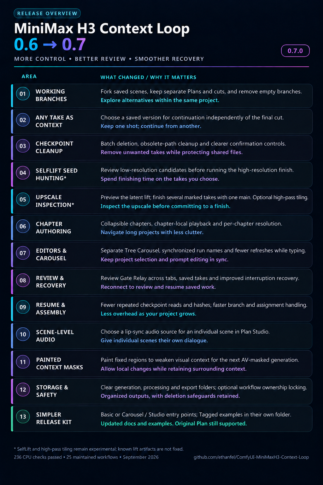

# MiniMax H3 Context Loop — 0.6 → 0.7

More control. Better review. Smoother recovery.

Shareable overview of **0.7.0**, based on the maintained 0.6 baseline and
the nightly/RC content promoted to main on September 24, 2026.

| Area | What changed | Why it matters |
|---|---|---|
| Working branches | Fork saved scenes, keep separate Plans and cuts, and remove empty branches. | Explore alternatives within the same project. |
| Any take as context | Choose a saved version for continuation independently of the final cut. | Keep one shot; continue from another. |
| Checkpoint cleanup | Batch deletion, obsolete-path cleanup and clearer confirmation controls. | Remove unwanted takes while protecting shared files. |
| SelfLift seed hunting* | Review low-resolution candidates before running the high-resolution finish. | Spend finishing time on the takes you choose. |
| Upscale inspection* | Preview the latent lift; finish several marked takes with one main. Optional high-pass tiling. | Inspect the upscale before committing to a finish. |
| Chapter authoring | Collapsible chapters, chapter-local playback and per-chapter resolution. | Navigate long projects with less clutter. |
| Editors & Carousel | Separate Tree Carousel, synchronized run names and fewer refreshes while typing. | Keep project selection and prompt editing in sync. |
| Review & recovery | Review Gate Relay across tabs, saved takes and improved interruption recovery. | Reconnect to review and resume saved work. |
| Resume & assembly | Fewer repeated checkpoint reads and hashes; faster branch and assignment handling. | Less overhead as your project grows. |
| Scene-level audio | Choose a lip-sync audio source for an individual scene in Plan Studio. | Give individual scenes their own dialogue. |
| Painted context masks | Paint fixed regions to weaken visual context for the next AV-masked generation. | Allow local changes while retaining surrounding context. |
| Storage & safety | Clear generation, processing and export folders; optional workflow ownership locking. | Organized outputs, with deletion safeguards retained. |
| Simpler release kit | Basic or Carousel / Studio entry points; Tagged examples in their own folder. | Updated docs and examples. Original Plan still supported. |

\* SelfLift and high-pass tiling remain experimental; known lift artifacts are not fixed.

**236 CPU checks passed · 25 maintained workflows · September 2026**

The original Context Loop Plan remains supported. Removed legacy nodes and
inputs are covered in the [migration notes](MIGRATING_TO_0_7.md).
See the [release notes](../RELEASE_NOTES_0_7.md) for scope and validation limits.

## Share card

The card matches the 0.6 overview's dark cyan/purple table style. It was
created with the built-in image-generation tool; the [generation prompt](assets/minimax-h3-context-loop-0.6-to-0.7-major-improvements.prompt.txt)
records the exact copy, layout brief and stable-badge edit. The original RC
card is retained alongside the release image. The table above is the editable text.
