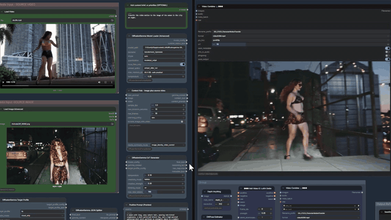

<p align="center">
  
</p>

# ComfyUI DiffusionGemma Prompt Builder

DiffusionGemma Director provides a stable five-node prompt-authoring core for ComfyUI: choose one model-specific Target Profile node between Context Hub and the shared Director/validation path. Four stable Director companion nodes, two optional reference-preparation nodes, eleven audio/music-video production controls, and six production-planning controls extend that core. The package also exports two experimental SplatStage motion-planning nodes. A separate twenty-two-node Advertisement surface adds typed campaign, reference, soundtrack, shared settings, transport repair, planning, relay, finishing, and QA contracts without changing the established workflows. DiffusionGemma writes and validates prompts or blueprints; it is not the downstream image or video sampler.

The primary stable workflow is the working LTX 2.3 character motion-transfer graph in `examples/07_ltx23_character_motion_transfer.json`. Additional Director examples cover native MiniMax H3 T2VA and Ref2VA paths. The accumulated synchronized music-video production graph is preserved in `examples/15_minimax_h3_ref2va_music_video_v6.json`; replace its two saved `LoadImage` choices with your own primary identity image and same-person contact sheet before running it. Advertisement work is additive and isolated: it does not migrate, overwrite, or silently change that known-good V6 graph.

## Exported Nodes

Fifty-five nodes are registered in ComfyUI: the established thirty-three-node Director/music-video surface and the separate twenty-two-node Advertisement surface. Stable, compatibility, optional, experimental, and Advertisement responsibilities remain intentionally distinct.

### Stable Director Assistant

The five-node core path used by the primary LTX workflow is:

- `DiffusionGemmaModelLoader` - loads the local Transformers/NVFP4 DiffusionGemma runtime.
- `DiffusionGemmaContextHub` - combines user text, optional image/video inputs, and optional `visual_description` into one `DG_CONTEXT`.
- Choose exactly one model-specific target node:
  - `DiffusionGemmaLTX25TargetProfile` - LTX generation mode, duration, Experimental Long Horizon planning, style, joint audio/video guidance, and negative prompt controls.
  - `DiffusionGemmaMiniMaxH3TargetProfile` - H3 T2VA/Ref2VA mode, duration, audio, shot count, dialogue, and integrated exclusion controls.
  - `DiffusionGemmaIdeogram4TargetProfile` - image aspect ratio, render style, exact visible text, JSON/prose representation, and negative prompt controls. It deliberately has no duration or audio widgets.
- `DiffusionGemmaCoTGenerator` - asks DiffusionGemma for the final prompt packet and returns final JSON plus debug outputs.
- `DiffusionGemmaJSONSplitter` - turns the final JSON into LTX, Ideogram4, or MiniMax H3 prompt output plus metadata, resolution, segment, and readiness outputs.

Four stable companions extend that core without changing it:

- `DiffusionGemmaH3ReferenceContext` - binds an ordered H3 asset-role manifest and optional picture/video evidence into a Ref2VA-aware `DG_CONTEXT`, with an optional exact semantic-Subject count.
- `DiffusionGemmaGroundingGuardSettings` - configures visual-transport checks, structured evidence validation, bounded retry, and optional fail-closed behavior through `DG_GROUNDING_GUARD_CONFIG`.
- `DiffusionGemmaGenerationGate` - fails closed when validation says a prompt is not ready, preventing an invalid prompt from reaching a downstream generator.
- `DiffusionGemmaBranchGenerationGate` - provides the same validation for comparison graphs, but blocks only its own prompt output and exposes a diagnostic status instead of canceling independent model branches. This isolation applies to validation blockers; an uncaught sampler, CUDA, or out-of-memory error can still abort a shared queue.

### Optional Reference Preparation

- `DiffusionGemmaReferencePrep` - resizes one image for Director analysis, with source-aspect preservation, optional center crop, and upscaling disabled by default.
- `DiffusionGemmaH3ReferencePairPrep` - keeps two H3 references on separate sockets and shares one downscale-only pixel budget between them. It preserves each aspect ratio and reports the resulting dimensions and packed-reference-row estimate.

These nodes appear under `prompt/diffusiongemma/optional`. The pair node affects only H3 image-reference conditioning; it does not resize the generated video or reduce its duration or sampler steps.

### Experimental Motion Planning

These larger planners are exported for opt-in SplatStage work, but they are not part of the stable Director surface or the primary LTX workflow:

- `DiffusionGemmaSplatStagePlanner` - writes and validates the strict SplatStage show blueprint.
- `DiffusionGemmaSplatStageEfficientPlanner` - writes and validates the higher-variation efficient SplatStage blueprint.

Both are labeled `(Experimental)` and appear under `prompt/diffusiongemma/experimental-motion-planning` in ComfyUI. Their schemas ship with this repository, while executing a resulting show still requires the appropriate downstream SplatStage workflow and nodes.

`DiffusionGemmaSplatStagePlanner` accepts any positive finite planning duration and any positive `W:H` ratio or `WxH` resolution expression. These values guide the creative blueprint only; they do not override a downstream renderer's frame clock or raster. The synchronized LTX + ACE workflow supplies those settings independently. Classic SplatStage production graphs remain fixed to their own legacy clip and resolution contract.

### Decoded-Audio Production Controls

These controls appear under `prompt/diffusiongemma/audio-production` and support the synchronized ACE-Step + LTX workflow:

- `DiffusionGemmaMusicProductionConcept` is the single shared choice for both the SplatStage Planner and Song Blueprint Router. **Source passthrough means the authored ACE song blueprint passes through unchanged; it is not file-audio passthrough.** Source passthrough and Joint video-safe plan resolve to one ACE song; Audition and select activates a user-selected two to four candidates, with two as the bounded default.
- `DiffusionGemmaSongSeedFanout` derives four reproducible song-candidate seeds from a song seed that remains independent of the LTX sampling seed.
- `DiffusionGemmaUploadSong` provides a lazy-safe upload/selection widget for a custom soundtrack. A blank uploader cannot invalidate an ACE run, and a selected file is confined to ComfyUI's input directory before decoding.
- `DiffusionGemmaSongSourceRouter` is the independent soundtrack-origin toggle: **Generate with ACE-Step** preserves the existing candidate lanes, while **Upload song** keeps ACE audio generation dormant and submits the custom waveform to the same selector, excerpt, and hash-lock path. Uploaded BPM is optional (`0` uses signal-only analysis); uploaded lyrics are used only as downstream lyric evidence and may remain blank for Natural or Dance mode.
- `DiffusionGemmaAudioCandidateSelector` lazily renders only the requested candidate lanes, measures the decoded waveforms, selects a usable excerpt, and blocks LTX when no candidate passes. It can lock a candidate or exact waveform SHA-256 without silently substituting another song.
- `DiffusionGemmaLTXAudioGuide` separates the audio that conditions LTX from the untouched final soundtrack. `full_mix` is an identity path, `sync_safe` retains timing and center/vocal information while softening transient pressure, and `vocal_only` requires a connected vocal stem.
- `DiffusionGemmaLTXPerformancePrompt` sits after the validated Director gate and changes only prompt text. **Natural / audio-led sync** adds no lyric schedule and lets connected audio govern whether articulation naturally occurs. **Dance / music sync** deliberately suppresses singing, speaking, mouthing, and lip-sync while retaining beat-, phrase-, and dynamics-aware body motion. **Lyrics + lip sync** supplies a bounded authored-lyric window only as lexical/pronunciation candidates; it no longer orders a subject to sing every selected line. The node never changes the conditioning waveform or pristine final soundtrack.
- `DiffusionGemmaMusicVideoPerformanceMode` makes Natural, Dance, or Lyrics one shared choice before the video Director. It is the single authoritative mode supplied to target guidance, lyric-window selection, timed-lyrics analysis, and H3 lane planning.
- `DiffusionGemmaTimedLyricsAnalyzer` is lazy: Natural and Dance do not evaluate its separator or Whisper inputs. Lyrics mode validates a local Demucs vocal stem, transcribes only detected vocal intervals in chunks no longer than 15 seconds, aligns those phrases monotonically to authored lyric lines, and emits a song-hash-, lyric-hash-, and excerpt-locked timing report. Separator fallbacks, silence, weak alignment, stale evidence, or transcription/model errors produce a safe Natural/audio-led report instead of blocking video or inventing singing. Confirmed instrumental intervals are explicit non-vocal evidence.
- `DiffusionGemmaACEReferenceMode` and `DiffusionGemmaACECoverConditioning` expose a lazy Compose/Cover experiment. Cover fails closed until a valid reference-audio latent is connected and requires ACE semantic-code generation to be disabled.

The production concepts are deliberately different workflows, not post-generation repairs. The SplatStage Planner receives the Context Hub image pixels on a pixel-capable backend, so its song, lyrics, performer, environment, palette, and effects can be co-authored from the same image and creative brief used by the video Director. Source passthrough preserves one jointly authored `ace_tags`/lyrics/BPM/key/meter bundle. Joint video-safe plan asks DiffusionGemma to author lower transient, tonal, section, and lyric pressure before ACE generates anything. Audition and select keeps that coherent bundle intact, varies only the deterministic song seed, then judges the waveform that actually exists. The Song Blueprint Router never injects chord symbols, BPM, key, or theory prose into `ace_tags`, and it never compacts already-authored lyrics.

An explicitly requested soundtrack genre, subgenre, era, instrumentation, groove, or production style is authoritative over the image's visual setting. Neon, nightclub, dance, party, wardrobe, lighting, and other scene evidence may shape the visual lanes and lyrical imagery, but they do not turn another requested genre into EDM or a crossover. Words such as “juxtaposed” and “against” mean audiovisual contrast; the Planner creates a musical fusion only when the brief explicitly asks for one. Lyrics use ACE bracketed section labels such as `[Verse]` and `[Chorus]`.

Decoded-audio QC is a lightweight CPU signal heuristic, not transcription, source separation, note-level tuning proof, or a universal definition of good music. A half-time accent is accepted as an advisory when its canonical tempo is within 5% of the requested BPM. A canonically aligned double-time reading is advisory when canonical error is within 5%, excerpt onset pressure is at most 4.0/s, vocal activity is present, and at least two of four supporting signals pass: visual-recovery coverage, excerpt score, tonal-family consistency, or transition stability. It remains score-penalized and visibly advisory. Dense or weakly supported double-time, canonically misaligned or undetected tempo, dense selected excerpts, source-channel clipping, silence, broadband noise/artifact-like spectra, and strong tonal discontinuity remain blocking. `minimum_score` is only the weighted numeric floor and cannot bypass those hard QC checks. Automatic selection favors direct/aligned-half candidates, then recovery coverage for accepted double-time candidates, the actual LTX excerpt score, and the whole-song score. Listen to the selected song, then lock its candidate/hash and excerpt start for repeatable production. A failed lock blocks rather than falling back.

Uploaded songs use a separate source-locked posture because the user has already chosen the music. Invalid shape, excessive decoded size/duration, a track shorter than the requested excerpt, silence, clipping, and artifact-like broadband noise remain blocking. Tempo interpretation, vocal-presence proxy, onset pressure, tonal movement, and the generated-candidate production score remain measured and visible but advisory; they cannot replace or reject an otherwise technically usable uploaded song. ComfyUI still includes linked lazy ancestors in cache signatures, so changing a dormant upload selection may invalidate downstream cache entries even though the file is not decoded and ACE audio remains the only executed source.

In the synchronized workflow, the selected report is also supplied to Director so camera and body motion can follow the measured excerpt instead of requested metadata. The selected pristine excerpt remains the final muxed soundtrack. A separate timing-identical guide is Audio-VAE encoded with a zero noise mask and supplied to both LTX sampling stages; the original waveform is never replaced by the guide. `A2V influence` remains neutral at `1.0` by default and should be tested cautiously with the same locked song and video seed.

### Production Planning Controls

These controls appear under `prompt/diffusiongemma/production-planning` and provide the first project-orchestration layer for synchronized MiniMax-H3 production:

- `DiffusionGemmaProjectMasterContract` locks the approved song hash plus excerpt window, brief, duration, master aspect, H3 generation-lane ceiling, and requested deliverables into a deterministic project manifest. Its legacy `recommended_h3_shot_count` output means the number of duration-bounded H3 invocations, not the number of native camera cuts.
- `DiffusionGemmaAudioAwareMultiShotPlanner` divides a validated Ref2VA prompt into one to four H3 generation segments. One segment may preserve several consecutive native `[Shot N]` blocks. Boundary selection prefers native shot boundaries with measured low-density recovery, then native-only and mixed native/recovery sequences. If none can obey every hard lane-duration limit, the planner uses deterministic duration-balanced seams, records each seam's literal provenance, and carries the source shot already active at a non-native seam into the next lane so later native timestamps stay exact. Timestamped sub-cues are sliced with that carry: the latest elapsed cue becomes explicit opening-state history, in-lane cues are rebased, and future cues are deferred to the later lane instead of blocking or firing early. Each segment also carries a local clock, exact retained-frame allocation, continuity contract, and the shared Natural, Dance, or Lyrics performance mode. Lyrics mode accepts only a validated timed-lyrics report, clips verified events into each lane's local clock, marks fully instrumental lanes non-vocal, and otherwise falls back to Natural/audio-led behavior.
- `DiffusionGemmaH3RelayReferenceGate` optionally routes the retained tail of the previous H3 lane as a low-budget continuity reference for the next lane. The original identity references remain authoritative, relay is identity-first and off by default, and disabled downstream lanes do not request upstream media.
- `DiffusionGemmaH3ShotSeedFanout` derives deterministic per-generation-lane video seeds from the separate H3 root seed and project id.
- `DiffusionGemmaH3ShotAssembler` lazily requests only the planned H3 lanes, trims every decoded segment at its retained cut, verifies the master clock and soundtrack duration, concatenates exact frames, and passes the pristine audio object through unchanged.
- `DiffusionGemmaMultiFormatDeliveryPlanner` records requested reframes and cutdowns as plan-only deliverables; it never claims alternate media was rendered.

### Advertisement Production System

The Advertisement nodes appear under `prompt/diffusiongemma/advertising`. They form a separate, versioned contract stack so commercial fields and delivery rules do not leak into the generic Director or the known-good music-video V6 workflow.

- Campaign and reference contracts type the brand, product, audience, objective, exact copy, substantiated claims, duration, aspect, end card, and deliverables. Reference preparation normalizes and hashes three user-selected image inputs; users do not paste hashes. Picture 1 is the performer hero, Picture 2 is a same-performer contact sheet, Picture 3 is an independent product/package contact sheet, and Picture 4 is a hash-verified, downscaled copy of the exact retained final frame from the previous H3 lane. Picture 4 is continuity evidence only and never becomes performer or product authority. Performer and product references are not merged into one identity sheet.
- `DiffusionGemmaAdvertisementWorkflowControls` is the saved workflow's one shared settings authority. Advertisement v1 intentionally locks the governed 30-second, 9:16 master and 30/15/6 deliverable contract; Ref2VA mode; H3 audio/dialogue policies; zero-second excerpt start; MiniMax H3 generation model; and 15-second lane ceiling. It shares one native-shot count with Director and the Advertisement planner, drives the splitter aspect, derives tail cutdown starts, and exposes only Natural or Dance performance. Unsupported reference layouts, non-relay seam modes, Lyrics performance without timed evidence, and separate VO without an input path are hidden from this v1 UI rather than offered as broken choices.
- The soundtrack contract supports `Instrumental`, `Vocal`, and `Auto` content policy and emits a structured MiniMax Music 3 caption plus separately tagged lyrics. The lazy source router exposes three origins: **MiniMax Music 3** by default, **Upload song**, and **Legacy ACE-Step**. An instrumental generated candidate does not need a vocal proxy; a vocal candidate does. All selected sources still pass technical integrity, excerpt, provenance, and waveform-hash locking.
- A 30-second campaign requests a 35-second MiniMax Music 3 candidate so the selector has five seconds of headroom; generated duration is capped at 60 seconds. The verified local route uses `minimax_music3_text_encoder_pruned_int8_convrot.safetensors` with the native MiniMax Music 3 text encoder, `minimax_music3_dit_fp16.safetensors`, and `minimax_music3_dav.safetensors`.
- The Advertisement mixer sends a soundtrack-only motion guide to H3. Its reusable node contract supports later non-diegetic voice-over with ducking, hashes, and clipping diagnostics, but the shipped v1 workflow locks VO to `None` until an upload/loader path is connected. A sub-millisecond source-window rounding deficit may be right-padded by at most one millisecond and is recorded; materially short audio still fails closed.
- The Advertisement planner preserves the Picture 1/2 performer authorities and Picture 3 product authority on every lane, while Picture 4 carries only the retained previous-lane tail. The finishing path rejects raster dimensions outside the model-compatible contracted-aspect tolerance, assembles an exact 30-second 9:16 master, replaces its governed tail with a deterministic exact-copy end card, and renders actual 15-second and 6-second frame/audio cutdowns. Requested 1:1 and 16:9 adaptations remain explicitly unrendered until a semantic reframe renderer is connected.
- Media QA reports `pass`, `fail`, or `not_measured` per check. Product identity, performer identity, copy legibility, audio sync, and technical integrity are a host-owned baseline that an edited widget cannot remove. A bare `pass` without evidence is downgraded to `not_measured`. The three automatic video saves are explicitly labeled and stored as review drafts; a completed ComfyUI queue is not delivery approval.

The Advertisement-owned Director transport repair uses the host-final packet by default and preserves its grounding, runtime, and cache evidence. It may recover the raw model-authored H3 object only when the host explicitly reports JSON parsing failed, plain salvage succeeded, and no real template fallback occurred. Recovery is bounded to invalid in-string backslashes plus exact governed Subject-row delimiters completed from the SHA-locked reference contract; duplicate keys, non-finite values, malformed Unicode, excess repairs, extra prose, metadata disagreement, and reference-authority changes fail closed. The existing H3 validator remains authoritative for prompt structure. The Advertisement-owned memory barrier releases Music 3 resources before Director and H3 without requiring unrelated cleanup-node packs. Schemas under `schemas/advertisement_*.schema.json` version the campaign, references, soundtrack, planning, relay, mix, delivery, adaptation, and QA payloads. Assembly, end-card, and finish reports are hash- and tensor-verified by their host nodes but do not currently have standalone JSON Schema files.

The Project Contract is authoritative for aspect, maximum H3 generation-segment length, and resulting lane count. Director and the MiniMax-H3 Target Profile remain authoritative for the unique native `[Shot N]` schedule inside those lanes. Missing ideal cut evidence is advisory rather than fatal; the plan exposes boundary-policy revision 2, selected strategy, evidence booleans, carry-in fragments, realized lane durations, and whether the non-binding preferred duration was actually realizable. Structural errors such as invalid clocks, duplicate/gapped/empty native shot blocks, out-of-range timestamps, stale audio locks, malformed identity manifests, impossible minimum/maximum limits, or more than four required lanes still fail closed. Missing, stale, weak, or malformed lyric timing also remains non-fatal: the planner records a warning and uses Natural/audio-led articulation. Written lyrics are never treated as a timing schedule. H3-generated audio is intentionally discarded; only the selected, hash-locked soundtrack excerpt is muxed into the assembled video.

The former universal `DiffusionGemmaTargetProfile` remains registered and marked deprecated so existing saved workflows continue to load with their exact widget order. New workflows should use one of the three model-specific targets. Other compatibility and utility classes remain in source where exported nodes reuse their behavior internally. The `ltx_reframe.py` module and LTX reframe workflows are retained as unexported prototypes; the retired `ltx_reframe_layout.js` frontend is not part of this release.

## Packaged Workflow

The release workflow is:

```text
examples/07_ltx23_character_motion_transfer.json
```

It uses a reference image for character identity and a source video for pose, motion, camera choreography, depth, Canny/edge structure, composition, timing, and scene geometry. It includes Canny, Depth, and DWPose control branches for comparison.

Bundled media lives in:

```text
examples/assets/character_motion_transfer
```

Before running the workflow, copy that folder to:

```text
ComfyUI/input/character_motion_transfer
```

The workflow expects these input paths:

```text
character_motion_transfer/character_reference.png
character_motion_transfer/motion_control_video.mp4
```

The demo output is also included:

```text
examples/assets/character_motion_transfer/diffusiongemma_ltx_character_demo.mp4
examples/assets/character_motion_transfer/diffusiongemma_ltx_character_demo.gif
```

## Separate Advertisement Workflow

The governed GlowBloom advertisement path is a separate MiniMax-H3 Ref2VA system rather than an edit to the music-video V6 graph. Its user-editable ComfyUI workflow is:

```text
examples/16_minimax_h3_ref2va_advertisement_music3_v1.json
```

The corresponding API-format production fixture is a deliberately Music3-only validation graph:

```text
examples/api/17_minimax_h3_ref2va_advertisement_music3_glowbloom_v1_api.json
```

The workflow has a fresh revision-1 graph identity and shares no mutable subgraph UUID with V6. It uses MiniMax Music 3 as its saved default, with Upload song and Legacy ACE-Step available through the lazy source router; the smaller API fixture contains only the default MiniMax Music 3 source and does not claim those UI-only fallbacks. It expects three user assets in the Picture 1 performer / Picture 2 same-performer sheet / Picture 3 product sheet order; Picture 4 is supplied only by the retained-tail relay between H3 lanes. Reference Asset Prep derives all three SHA-256 values from the selected images and keeps the product budget independent. `ADVERTISEMENT CONTROLS` is the one shared 30-second duration, native-shot, performance, and 30/15/6 delivery authority; duplicated consumer widgets are linked rather than independently editable. The saved Grounding Guard is explicitly labeled as an **OFF baseline**; the separate reference contract, governed packet repair, JSON splitter, and branch gate remain active and fail closed.

The Director loader uses the portable path `models/LLM/diffusiongemma-26B-A4B-it-NVFP4`, relative to the ComfyUI application directory. If ComfyUI is launched from a different working directory or the checkpoint is stored elsewhere, edit that one **Load DiffusionGemma Director** field to the full local repo-folder path before queueing.

For the 30-second preset, Music 3 generates a 35-second candidate and the selector locks one exact 30-second excerpt. H3 receives the music-only motion guide. The reusable mixer supports separate final-mix VO, but this v1 workflow keeps VO disabled until it has an actual input path. The finishing nodes render a deterministic three-second end card containing normalized, case-preserved governed copy and produce real tail-selected 15-second and 6-second cutdowns from the finished master.

The exact release graph is runtime-proven end to end on an isolated ComfyUI `0.33.1` installation with the pruned INT8/ConvRot Music 3 text encoder and the listed H3 assets. The 99-node API graph completed both 15-second H3 lanes, persistent Picture 4 relay, deterministic finishing, every diagnostic root, and real 30-second/15-second/6-second review drafts. The master was exactly 720 frames at 480x864 and 24 fps with a 30.000-second stereo soundtrack; the cutdowns were exactly 360 and 144 frames with matching 15.000-second and 6.000-second audio. A sampled visual contact-sheet review found stable performer/wardrobe and recognizable product continuity plus a legible deterministic end card. These facts establish technical execution, not delivery approval: the saved QA status still blocks delivery until evidence-backed performer, product, copy, and audio-sync review is recorded.

Known limitations:

- MiniMax-H3 generation remains stochastic. Multiple references and retained-tail continuity reduce drift but cannot guarantee performer likeness, product geometry, packaging text, or demographic presentation.
- Exact brand, CTA, and legal copy is guaranteed only in the deterministic end card. Do not treat generated in-scene labels as reliable typography or a substantiated claim.
- The 15-second and 6-second outputs are real temporal cutdowns. Requested 1:1 and 16:9 adaptations are status-only until a semantic reframe renderer is connected.
- Visual identity, package consistency, copy legibility, and audio sync require measured or human evidence. The QA gate intentionally reports `not_measured` and keeps delivery unapproved when that evidence is absent.
- MiniMax Music 3 tempo remains generative. The runtime-proven candidate passed technical QC but the signal analyzer estimated `87.890625` BPM against the requested `122`, and recorded that mismatch as an advisory. H3 follows the selected waveform itself; use a locked upload or stricter candidate policy when an exact tempo is mandatory.
- Automatic saves are review drafts, not QA-gated delivery exports. A pass requires evidence for every required check; a bare pass is downgraded to `not_measured`.
- The combined editable workflow includes a real Legacy ACE fallback. ComfyUI may validate linked lazy loader/model choices before branch selection, so `acestep_v1.5_turbo.safetensors`, `qwen_0.6b_ace15.safetensors`, `qwen_4b_ace15.safetensors`, and `ace_1.5_vae.safetensors` must remain visible even when MiniMax Music 3 is selected. The Music3-only API fixture does not require that fallback branch.
- The fictional GlowBloom references, soundtrack, and rendered campaign media are not bundled as distributable production assets. Replace the fixture's local input selections and review every claim before commercial use.

## Recommended Wiring

For custom workflows, the core DiffusionGemma path is:

```text
Text String -> DiffusionGemma Context Hub
Image or Video -> DiffusionGemma Context Hub
One model-specific Target Profile -> DiffusionGemma CoT Generator
DiffusionGemma Model Loader (Advanced) -> DiffusionGemma CoT Generator
DiffusionGemma Context Hub -> DiffusionGemma CoT Generator
DiffusionGemma Grounding Guard Settings -> DiffusionGemma CoT Generator (optional; strict for flagship workflows)
DiffusionGemma CoT Generator.final_json -> DiffusionGemma JSON Splitter
DiffusionGemma JSON Splitter.ltx_prompt -> DiffusionGemma Generation Gate.prompt
DiffusionGemma JSON Splitter.ready_for_generation -> DiffusionGemma Generation Gate.ready_for_generation
DiffusionGemma JSON Splitter.metadata_json -> DiffusionGemma Generation Gate.metadata_json
DiffusionGemma Generation Gate.prompt -> LTX positive prompt input
DiffusionGemma JSON Splitter.negative_prompt -> LTX negative prompt input
```

Use the original `DiffusionGemma Generation Gate` for a single generation branch: an invalid packet raises a workflow error and makes the failed validation impossible to overlook. For side-by-side workflows, use one `DiffusionGemma Branch Generation Gate` per model. Its `prompt` output still fails closed with a branch-local `ExecutionBlocker`, while its `status` output explains the validation result and independent ready branches are allowed to continue. Connect only the branch gate's `prompt` output to that model's sampler, and connect `status` to `Preview Any` so a silently blocked branch remains diagnosable. This isolates packet-validation failures only; queue LTX and H3 as separate **Run Branch** jobs when CUDA, OOM, or sampler-failure isolation matters.

Use `image_identity_video_control` on the Context Hub when the reference image should define the output subject while the video provides motion, pose, camera, depth, Canny/edge layout, blocking, and timing.

### LTX-2.5 mode selection

Use `DiffusionGemma LTX-2.5 Target Profile` and keep `generation_mode` on `Auto (recommended)` for normal use:

- No Context Hub frame sockets connected selects text-to-video.
- `image` connected selects image-to-video and treats it as the exact first frame.
- `image` plus the dedicated `last_frame_image` socket selects first+last-frame video.
- A source video or the existing `image_identity_video_control` mode keeps the backward-compatible source-video compiler path.

Connect the same first/last images to the native LTX conditioning nodes. Director uses the Context Hub copies only for visual analysis and contract validation; it does not secretly wire the LTX sampler. For I2V and first+last-frame work, Director requires one continuous take, checks the generated opening against verified first-frame facts, and rejects cuts or shot/action overload that cannot fit the selected duration. The compiler asks every shot to open with one of LTX's six canonical types (`extreme wide shot`, `wide shot`, `medium shot`, `medium close-up`, `close-up`, or `extreme close-up`) before describing its camera path; a later destination scale does not replace that opening type. A connected conditioning frame supplies otherwise-unstated opening scale and viewpoint geometry instead of making Director guess and block, while frame-free T2V and every post-cut shot remain strict. Compatible simultaneous or sequential camera-motion phases may form one physically continuous path and evolve to a new endpoint scale without becoming a cut; unusually dense camera choreography is diagnostic advice, not a hard numeric gate. Generation Gate reports corrective sentences rather than requiring users to decode validation identifiers.

`Experimental Long Horizon` is an LTX Target Profile planning control for unusually long continuous generations. Its default is `Off`, preserving saved-workflow behavior. `Auto (>20 seconds)` activates only when the resolved planning duration is strictly greater than 20 seconds; exactly 20 seconds remains on the standard contract. `On` forces the policy at any duration.

When active, Director silently plans four duration-scaled phases—establish, commit, sustain/reveal, and settle/hold—then compiles them into one continuous paragraph of no more than 200 words and generally four to eight sentences. These phases are not chapters, shots, scene changes, emitted headings, or timecodes. I2V planning keeps only the minimal critical first-frame anchors needed for continuity, selects one physically continuous camera intention, preserves explicitly requested transformations, and defines a terminal composition. Missing phase, conservation, or terminal cues produce non-blocking diagnostics rather than a Generation Gate failure.

The toggle improves semantic pacing; it does not add geometric conditioning or guarantee one-minute object reconstruction. Pair it with a first/last frame or a duration-matched depth/control sequence when the final composition or camera geometry must be constrained. The offline [5/20/60-second benchmark protocol](benchmarks/ltx25_long_horizon_v1/README.md) defines the unexecuted bare/current/long-horizon/structural comparison and preserves both sampler seeds without claiming render results that have not been collected.

All five creativity modes apply to LTX I2V and first+last-frame video. A still anchor fixes its visible pose, framing, and camera geometry only at that anchored instant; it does not prove a static future path. An explicit user or verified-media camera instruction—including a locked/static hold—always wins. Faithful preserves requested camera speed, direction, and compound phases exactly, and chooses the least-invasive suitable path only when motion is unspecified. Editorial, cinematic, concept-art, and wild may author increasingly expressive, tempo-appropriate compound camera choreography when the future path is unspecified, while retaining the exact anchors, one continuous take, and no cuts. `creative_strength` scales that motion ambition without imposing a numeric phase cap.

The JSON Splitter's resolution controls are downstream sampler controls and do not invalidate the Director cache. Choose an explicit `resolution_aspect_ratio`, megapixel budget, and alignment multiple, then connect `resolution_width` and `resolution_height` to the native LTX generator. `Auto (target/source)` matches an attached LTX first frame to the nearest supported ratio and defaults frame-free LTX to `16:9`; it no longer inherits Ideogram's `1:1` default.

Do not use `DiffusionGemma H3 Reference Context` for LTX. It declares H3 Ref2VA asset semantics and is intentionally rejected by the LTX-2.5 readiness gate. Use the ordinary Context Hub instead.

If the Grounding Guard input is disconnected, the CoT Generator uses non-blocking `audit` mode. Connect a Settings node with `mode=off` when exact legacy generation behavior is required, or use `mode=strict` to prevent unverified visual claims from reaching the existing JSON Splitter and Generation Gate. The CoT Generator preserves its original first four outputs and appends `grounding_status` and `grounding_report_json`.

See [Grounding Guard](docs/GROUNDING_GUARD.md) for the mode contract, evidence schema, trace privacy rules, proof commands, and benchmark workflow.

### Director result cache and runtime telemetry

`DiffusionGemma CoT Generator` has a `director_cache_mode` control. `reuse` (the default) lets ComfyUI keep an unchanged Director branch in its normal in-memory graph cache, so changing an LTX-only control does not rerun an independent MiniMax-H3 branch (and vice versa). It also builds a SHA-256 key from the model/checkpoint and processor identity, Director implementation and schemas, exact creative controls, Grounding Guard configuration, target profile, media metadata, and hashes of the ordered tensors actually sent to the processor. A verified ready packet is stored as small JSON/text in ComfyUI's private system-user cache. A disk hit is served before the full DiffusionGemma model is constructed or loaded and survives restarts, cache eviction, and equivalent Director nodes. The disk key does not include downstream H3 seed, steps, sampler, scheduler, LoRA, decode, preview, or save controls.

`refresh` forces a new Director run and atomically replaces an eligible disk entry; it does not randomize generation. It is a one-run diagnostic setting: queue once, then immediately return it to `reuse`, because leaving `refresh` selected reruns Director on every queue. Identical inputs with a fixed Grounding Guard/Director seed are intentionally reproducible, so change that seed (or its after-generate policy) when you want a new prompt variant. `creativity_mode` chooses the kind of compatible prompt detail and, for LTX video, camera choreography; `creative_strength` chooses its qualitative intensity and camera-path ambition. Neither is a sampling-temperature or RNG control. `off` disables disk lookup and writes and recomputes every queue. Because ComfyUI's in-memory cache cannot distinguish a ready packet from a failed or salvaged one, an unchanged blocked result in `reuse` remains blocked until an input changes or `refresh` is selected for one retry; the Branch Generation Gate status states this recovery step. Detailed grounding traces always bypass both reuse layers so their requested trace side effect is never silently skipped. Blocked, refused, salvaged, template-fallback, unverified-audit, and otherwise non-ready packets are not stored on disk. Cache files contain plaintext prompt/debug outputs; the default location is private, and `DG_DIRECTOR_CACHE_DIR` can select another local directory.

The JSON Splitter keeps its normal `ltx_prompt` and `negative_prompt` outputs fail-closed, but also exposes appended `candidate_ltx_prompt` and `candidate_negative_prompt` diagnostics. Those candidate sockets update even when validation blocks generation, which prevents a Preview Any node from appearing to show a stale prior prompt. They are inspection-only and must never be connected directly to a native generator; generation continues through the normal prompt outputs and a Generation Gate.

Every returned `metadata_json` and `final_json.metadata` now contains `director_runtime` (`dg-director-runtime/1`). It separates cold model load, ModelOpt expert-bank bridge work, processor/media preparation, measured multimodal prefill when the installed model exposes the encoder boundary, model generation, grounding validation, unload, total time, generated tokens/characters, retry/call counts, cache time, and peak allocated VRAM. The `calls` list labels evidence, compiler, compiler-retry, and target-repair passes independently. Upstream Media Sampler video decoding is outside the CoT node and is explicitly excluded. These measurements are intended to guide later adaptive budgeting or grouped-NVFP4 work; the existing full H3 output budget is preserved.

For MiniMax H3, use `DiffusionGemma MiniMax-H3 Target Profile` and wire its same `target_profile_config` to both the CoT Generator and JSON Splitter:

```text
DiffusionGemma MiniMax-H3 Target Profile.target_profile_config -> DiffusionGemma CoT Generator.target_profile_config
DiffusionGemma MiniMax-H3 Target Profile.target_profile_config -> DiffusionGemma JSON Splitter.target_profile_config
DiffusionGemma CoT Generator.final_json -> DiffusionGemma JSON Splitter.final_json
DiffusionGemma JSON Splitter.minimax_h3_prompt -> MiniMax H3 text encoder prompt
```

The splitter appends `minimax_h3_prompt` after its existing outputs so saved LTX and Ideogram4 workflow output indices remain unchanged.

## MiniMax H3 T2VA Prompt Profile

With `generation_mode=t2va`, the MiniMax H3 target turns a normal creative brief into H3's canonical text-to-video/audio representation. T2VA does not invent keyframe or full-reference labels when Director has not been given explicit reference roles. Its output preserves section breaks and uses exactly these three fields in order:

```text
integrated_multimodal_description: [Shot 1] ...

overall_soundscape: ...

non_diegetic_music: ...
```

The first shot has no timestamp. Later cuts use increasing instants such as `[Shot 2] At 00:03.500, the camera cuts to...`, all inside the selected duration. Hard cuts are the default; cross-dissolves, fades, and wipes are used only when the brief requests them. Synchronized visible action, speech, and scene sounds stay in `integrated_multimodal_description`; ambient sound and Foley belong in `overall_soundscape`; audience-only score belongs in `non_diegetic_music`, where instrumentation, tempo/rhythm, and dynamic development are described concretely instead of as an abstract mood.

Every H3 shot also carries one explicit camera-behavior sentence. H3 does not inherit LTX's Stable / base-model Camera Capability: requested or reference-derived camera choreography is preserved, and non-faithful creativity modes may author expressive movement proportional to creative strength. Orbit/arc, roll/rotation, swirl, sweep or whip movement, controlled shake, pronounced parallax, and coherent compound paths are valid H3 tools. Moving-shot prose names the motion type, meaningful speed/amplitude, direction, subject relationship, and ending frame; compound phases must be physically compatible or explicitly ordered. The exact locked-off sentence remains only a deterministic last resort for a genuinely unspecified shot, so a valid complex path is never overwritten or paired with a contradictory static hold.

`shot_count` on the MiniMax-H3 Target Profile controls the number of native camera/cut blocks for both T2VA and Ref2VA. `auto` honors an exact count written in the creative brief and otherwise lets Director choose the fewest useful shots. Select `1` through `12`, or select `custom` and type a value from `1` through `99` in `custom_shot_count`. The custom number is ignored unless the selector is set to `custom`. Any explicit value requires exactly that many consecutive `[Shot N]` sections and overrides conflicting count wording in the brief. A shot is a camera/cut segment, not necessarily a narrative beat, chapter, scene change, or separate H3 generation pass; multiple native shots may execute inside one valid 4–15 second H3 clip. Do not connect the Project Master's generation-lane recommendation to this native shot-count control. Director validates the result and makes a bounded repair attempt; if the model still returns the wrong count, Generation Gate blocks it. Counts above 12 generally need more duration and Director output-token budget. This is a storyboard/compiler control, independent of the Grounding Guard's `evidence_token_budget`.

### MiniMax H3 dialogue controls

Dialogue is a separate MiniMax-H3 Target Profile contract rather than a side effect of `audio_mode=explicit_sound_design`. `dialogue_mode` has three settings:

- `auto` is the backward-compatible default. It preserves speech explicitly requested in the creative brief but does not invent speech when the brief is silent.
- `required` explicitly authorizes Director to write dialogue. Director plans the spoken timeline before decorative camera coverage, uses the existing shot plan rather than adding dialogue-only cuts, and the Generation Gate requires exactly `dialogue_line_count` complete dialogue blocks.
- `off` prohibits dialogue, narration, voiceover, and singing while leaving any enabled ambience, Foley, and instrumental music available.

`dialogue_line_count` accepts `1` through `12`, defaults to `2`, and is enforced only in `required` mode. One line means one complete native H3 block. `dialogue_guidance` is optional direction for speaker identity, language, voice, delivery, story purpose, or quoted wording. In `required` mode, blank guidance lets Director author concise lines; Director is instructed to preserve quoted wording. In `auto`, guidance applies only when the creative brief already requests speech. The hard gate is deliberately structural: it verifies dialogue presence, exact block count, placement, speaker cues, and native markup, but it does not claim to semantically prove compliance with arbitrary free-form guidance.

The native H3 speaker ID belongs outside the dialogue block, while the language and spoken words belong inside it:

```text
The protagonist (S1) says: <d>[English] We made it this far.</d>
```

For Ref2VA, retain the reference label as well: `<Subject 1> (S1) says: <d>[English] We made it this far.</d>`. Dialogue stays inside `integrated_multimodal_description` for T2VA or `detailed_description` for Ref2VA; it is not repeated in `overall_soundscape` or `non_diegetic_music`. `required` is incompatible with `audio_mode=visual_only`, and that configuration is rejected before generation.

A concise required-dialogue setup is:

```text
dialogue_mode = required
dialogue_line_count = 2
dialogue_guidance = English; on-screen protagonist S1; clear, determined delivery; exact lines: "We made it this far." and "Now let's finish it."
```

Dialogue still needs real playback time. Twelve shots in a 15-second video average only 1.25 seconds per shot, so keep required lines short and reserve one or more longer, locked or gently moving dialogue shots. For longer exchanges, reduce the shot count, reduce the dialogue count, or increase the duration instead of forcing speech across rapid cuts.

Dialogue repair is isolated from storyboard repair. Director first normalizes only unambiguous native-tag transport variants without changing the spoken words. If a structurally valid prompt is simply missing required lines, it makes one small text-only dialogue-patch call and host-compiles the model-authored words into canonical `(Sx) ... <d>[Language] ...</d>` markup inside existing shots. It never asks that patch call to rewrite the six Ref2VA sections, shot markers, timestamps, camera prose, reference roles, or grounding provenance. An ambiguous tag or invalid patch remains blocked rather than falling back to another full-storyboard rewrite.

`target_duration_seconds` remains user controlled and has no H3-specific upper clamp. MiniMax documents 4-15 seconds as the standard H3 generation range, so that range is useful quality guidance, but Director does not clamp longer requests. A value such as 20 seconds is retained in the prompt contract; the connected H3 workflow's frame count, sampler settings, VRAM, and generation time determine whether it can be rendered successfully. `0` uses source-media duration when available, then an explicit duration written in the creative brief, and otherwise a 5-second H3 planning default.

H3 does not expose a separate negative-conditioning prompt through its local text encoder. When MiniMax H3 is selected, Director keeps `negative_prompt` empty and expresses necessary exclusions concisely inside `integrated_multimodal_description` for T2VA or `detailed_description` for Ref2VA instead of inventing an unsupported negative channel.

See [`examples/09_minimax_h3_t2va_director.json`](examples/09_minimax_h3_t2va_director.json) for a native MiniMax-H3 T2VA workflow. It shares one user-editable duration between Director and H3, routes the dedicated H3 prompt plus computed resolution into the generator, previews both the generated prompt and any validation block reasons, unloads DiffusionGemma before sampling, and is preset to the proven 20-second, 25-step configuration. Because its Context Hub has no image or video connected, the visual Grounding Guard correctly reports `not_applicable`; connect source media to turn it into a grounded visual-analysis case.

## MiniMax H3 Ref2VA Prompt Profile

Set the MiniMax-H3 Target Profile to `generation_mode=ref2va` and build the context with `DiffusionGemmaH3ReferenceContext`. Its manifest is the asset-role contract for the native reference sockets, for example:

```text
<Picture 1>: [dg:identity,appearance] protagonist identity, face, hair, body, wardrobe, and distinguishing traits; preserve fully.
<Picture 2>: [dg:environment,lighting,color] environment, palette, lighting, and 2D animation style; do not transfer pictured subject identity.
<Audio 1>: synchronized soundtrack timing and impact-texture reference for <Video 1>; do not copy speech.
<Video 1>: [dg:action,motion,camera,composition,temporal] running motion, camera path, hard-cut rhythm, and landing mechanics; do not transfer performer identity.
```

`reference_manifest_preset` avoids retyping the common contracts. `custom` keeps using the editable manifest text. `1 image - all visual attributes` treats Picture 1 as the complete subject-and-scene reference. `2 images - subject + environment/style` assigns Picture 1 to subject identity and Picture 2 to environment/style. A selected preset overrides the text box at execution time, and the effective manifest appears in the context preview. Keep the image batch and native H3 reference sockets in the same order.

`expected_subject_count` is a separate Ref2VA compiler control on `DiffusionGemmaH3ReferenceContext`. `0` means Auto; a positive value requires exactly that many consecutive semantic `<Subject N>` definitions. It does **not** count people, attached pictures, or native reference sockets. One `<Picture 1>` can supply several independently tracked Subjects, while several Pictures can contribute attributes to one Subject. With an explicit count, Director prioritizes independently acting or identity-bearing people, creatures, and hero objects, and folds ordinary props, wardrobe, environment, lighting, composition, style, actions, and effects into those selected Subjects and the shot timeline instead of creating extra labels. Set the count only when the creative brief makes that tracking contract coherent.

Tags are one-based and numbered independently by type. Strict Grounding Guard mode requires a `[dg:...]` annotation on every connected Picture and Video role so role validation is host-owned and deterministic; audit mode may still infer category vocabulary from unannotated prose for compatibility diagnostics. The annotations are stripped before compilation and never enter the H3 prompt. Keep the manifest aligned with native H3: all pictures are presented first; a paired video soundtrack receives an Audio label immediately before its Video label; standalone audio follows the videos. Director supports the native local limits of nine pictures, three videos, three paired soundtracks, and three standalone audio inputs. It deliberately blocks an audio-only manifest because its Ref2VA compiler requires at least one visible reference source.

In comparison workflows, a Branch Generation Gate status reports whether that branch's compiled model packet is ready. It is not a substitute for the separate Grounding Guard status/report. `audit` keeps evidence diagnostics visible without blocking a render; `strict` is the later compliance mode when an unverified branch must stop.

Ref2VA output follows MiniMax's six-section Context-IR contract exactly:

```text
subject_definitions:
...

summary:
...

retention_analysis:
...

detailed_description:
...

overall_soundscape:
...

non_diegetic_music:
...
```

`<Subject N>` means reusable visible content abstracted from one or more assets; it is not an attachment number. Pictures used only for identity, environment, costume, or style are cited inside Subject definitions. A standalone Picture definition is reserved for a concrete composition/storyboard anchor. In the local native Ref2VA path, an identity/style picture is not a guaranteed first- or last-frame pixel lock; use the separate FL2VA path when that is the intended control.

The compiler requires official summary task types and retention markers, exact declared asset tags, consecutive Subject labels, a medium/style opening before `[Shot 1]`, a detailed chronological timeline, camera direction, reference use at the relevant moments, audio-layer fidelity, and a resolved final state. Invalid, missing, duplicate, or undeclared references block the splitter output instead of reaching H3.

See [`examples/10_minimax_h3_ref2va_director.json`](examples/10_minimax_h3_ref2va_director.json) for the native two-picture sample. It wires both original pictures to `MiniMaxH3ReferenceToVideo`, sends an ordered analysis batch to Director, uses a full 2048-token prompt budget, and retains the user-selected 20-second, 481-frame, 25-step configuration without running a render automatically.

For two differently sized pictures, insert `DiffusionGemmaH3ReferencePairPrep` before the native reference sockets:

```text
Picture 1 ---------------------> reference_image_1
Picture 2 ---------------------> reference_image_2
JSON Splitter width/height ----> generation_width/generation_height

reference_image_1 output ------> MiniMax H3 ref_image_0 / <Picture 1>
reference_image_2 output ------> MiniMax H3 ref_image_1 / <Picture 2>
```

Keep `MiniMaxH3ReferenceToVideo.ref_image_size=match`. A `combined_reference_area_ratio` of `1.0` lets both references together use at most about one generated frame's pixel area; `0.5` is a more aggressive reference cap. `reference_1_share=0.60` favors an identity image in Picture 1 and automatically gives unused allocation to Picture 2. The node never crops, pads, stretches, upscales, or batches the references, so their manifest order and framing remain intact.

Reference resizing is not a substitute for reducing the main H3 workload. Resolution, frame count, and sampling steps dominate long renders. Benchmark the plain INT8/ConvRot model with Sage Attention alone before adding acceleration patches. Spectrum's offline forecast path does not accelerate `euler_ancestral`; Sigma Shift changes the schedule rather than the number of model evaluations; and a Turbo LoRA used with a 20-step scheduler still runs 20 expensive steps and can disable the checkpoint's fast quantized linear path.

Official references:

- [MiniMax H3 repository and model overview](https://github.com/MiniMax-AI/MiniMax-H3)
- [MiniMax H3 prompt-writing skill](https://github.com/MiniMax-AI/MiniMax-H3/blob/main/skills/h3-prompt-writing/SKILL.md)
- [MiniMax H3 Base prompt guide](https://github.com/MiniMax-AI/MiniMax-H3/blob/main/skills/h3-prompt-writing/references/base-en.txt)
- [MiniMax H3 full-reference prompt guide](https://github.com/MiniMax-AI/MiniMax-H3/blob/main/skills/h3-prompt-writing/references/ref-en.txt)

## Compatibility

The established Director surface retains its ComfyUI `0.30.1` / Python 3.11 compatibility baseline. Registry metadata declares `requires-comfyui = ">=0.30.1"`: this remains the package-wide minimum-compatible-version constraint unless an exported node makes a newer core mandatory.

The separate Advertisement + native MiniMax Music 3 workflow requires ComfyUI `>=0.33.1`. Its complete two-lane H3 campaign path was runtime-proven on `0.33.1`, including the pruned INT8/ConvRot Music 3 text encoder, portable Director checkpoint path, governed two-call Director refinement, persistent relay, and exact 30/15/6 finishing. This narrower Advertisement requirement does not change the preserved V6 workflow, and technical completion does not override the Advertisement QA gate's evidence requirements.

## Runtime Dependencies

This pack assumes a working ComfyUI install with CUDA-capable PyTorch. The Python dependencies declared in `requirements.txt` are:

- `transformers>=5.12.1`
- `accelerate>=1.14.0`
- `comfy-kitchen>=0.2.10`
- `jsonschema>=4.26.0`
- `numpy>=1.26.0`
- `Pillow>=10.0.0`
- `safetensors>=0.7.0`
- `tqdm>=4.67.0`

The NVFP4 bridge also depends on ComfyUI exposing `comfy.quant_ops` and `comfy.ops`. On this workstation, `comfy-kitchen==0.2.10` is installed and the proof gate passes.

The local bridge does not require bundling a custom tensor file. It converts the ModelOpt NVFP4 tensors from the Hugging Face checkpoint at runtime: ModelOpt FP4 nibble order and `weight_scale` layout are adapted into Comfy's packed NVFP4 expert matmul layout. Keep the model weights as a normal Hugging Face repo folder and ship only the node source code.

## Models Used By The Example

DiffusionGemma prompt model:

- [nvidia/diffusiongemma-26B-A4B-it-NVFP4](https://huggingface.co/nvidia/diffusiongemma-26B-A4B-it-NVFP4)

Place the whole repo folder at:

```text
ComfyUI/models/LLM/diffusiongemma-26B-A4B-it-NVFP4
```

MiniMax Music 3 models used by the separate Advertisement fixture:

```text
ComfyUI/models/text_encoders/minimax_music3_text_encoder_pruned_int8_convrot.safetensors
ComfyUI/models/diffusion_models/minimax_music3_dit_fp16.safetensors
ComfyUI/models/vae/minimax_music3_dav.safetensors
```

The INT8/ConvRot text-encoder selection is the locally runtime-proven ComfyUI `0.33.1` path. Model files are not bundled with this repository.

MiniMax H3 models used by both Advertisement artifacts:

```text
ComfyUI/models/diffusion_models/minimax_h3_ref2va_pruned_int8_convrot.safetensors
ComfyUI/models/text_encoders/qwen3vl_32b_minimax_h3_nvfp4_awq.safetensors
ComfyUI/models/vae/minimax_h3_video_vae_fp16.safetensors
ComfyUI/models/vae/minimax_h3_audio_vae_fp32.safetensors
ComfyUI/models/loras/minimax_h3_ref2v_turbo_4step_v0.1_comfyui_bf16.safetensors
```

The saved baseline uses seven scheduler steps with the Turbo LoRA at strength `0.75`, video sigma shift `12`, and audio sigma shift `3`. These H3 files are also local dependencies and are not bundled.

The combined user-editable workflow also retains the Legacy ACE-Step fallback. Because ComfyUI can validate linked lazy model selections before executing the chosen branch, `acestep_v1.5_turbo.safetensors`, `qwen_0.6b_ace15.safetensors`, `qwen_4b_ace15.safetensors`, and `ace_1.5_vae.safetensors` must be discoverable even when the saved source mode remains MiniMax Music 3. The ACE fallback has no LoRA dependency. Use the Music3-only API fixture when that fallback is intentionally unavailable.

LTX 2.3 diffusion model:

- [Kijai/LTX2.3_comfy - ltx-2.3-22b-distilled_transformer_only_fp8_input_scaled_v3.safetensors](https://huggingface.co/Kijai/LTX2.3_comfy/blob/main/diffusion_models/ltx-2.3-22b-distilled_transformer_only_fp8_input_scaled_v3.safetensors)

Place in:

```text
ComfyUI/models/unet
```

LTX IC-LoRAs:

- [Lightricks/LTX-2.3-22b-IC-LoRA-Union-Control](https://huggingface.co/Lightricks/LTX-2.3-22b-IC-LoRA-Union-Control)
- [Lightricks/LTX-2.3-22b-IC-LoRA-Decompression](https://huggingface.co/Lightricks/LTX-2.3-22b-IC-LoRA-Decompression)

Place in:

```text
ComfyUI/models/loras
```

VAEs:

- [Kijai/LTX2.3_comfy - LTX23_video_vae_bf16.safetensors](https://huggingface.co/Kijai/LTX2.3_comfy/blob/main/vae/LTX23_video_vae_bf16.safetensors)
- [Kijai/LTX2.3_comfy - LTX23_audio_vae_bf16.safetensors](https://huggingface.co/Kijai/LTX2.3_comfy/tree/main/vae)

Place in:

```text
ComfyUI/models/vae
```

Text encoders:

- [Comfy-Org/ltx-2 - gemma_3_12B_it_fp4_mixed.safetensors](https://huggingface.co/Comfy-Org/ltx-2/blob/main/split_files/text_encoders/gemma_3_12B_it_fp4_mixed.safetensors)
- [Kijai/LTX2.3_comfy - ltx-2.3_text_projection_bf16.safetensors](https://huggingface.co/Kijai/LTX2.3_comfy/blob/main/text_encoders/ltx-2.3_text_projection_bf16.safetensors)

Place in:

```text
ComfyUI/models/text_encoders
```

Optional MiniMax-H3 timed-lyrics analysis:

- [openai/whisper-large-v3-turbo](https://huggingface.co/openai/whisper-large-v3-turbo), placed as the complete local repository at `ComfyUI/models/whisper/whisper-large-v3-turbo`.
- Torchaudio's `HDEMUCS_HIGH_MUSDB_PLUS` checkpoint, installed through the torchaudio pipeline cache. On Windows this normally resolves below the user's `.cache/torch/hub/torchaudio/models` directory.

The V5 workflow keeps both branches lazy outside Lyrics mode. Its Whisper loader has `download_missing=False`; install the exact local snapshot before selecting Lyrics so a network change cannot silently alter a repeatable run.

Latent upscaler:

- [Lightricks/LTX-2.3 - ltx-2.3-spatial-upscaler-x2-1.1.safetensors](https://huggingface.co/Lightricks/LTX-2.3/blob/main/ltx-2.3-spatial-upscaler-x2-1.1.safetensors)

Place in:

```text
ComfyUI/models/latent_upscale_models
```

## Custom Node Dependencies For The Example

Install missing packs through ComfyUI Manager when possible:

- `ComfyUI-LTXVideo`
- `comfyui-videohelpersuite`
- `comfyui-kjnodes`
- `comfyui_controlnet_aux`
- `comfyui_essentials`
- `comfyui-easy-use`
- `comfy-mtb` for the local Whisper loader
- `comfyui_fill-nodes` for Hybrid Demucs vocal separation
- `RES4LYF`

Core ComfyUI supplies several additional LTX nodes used by the workflow, including video loaders, LTX preprocessing/conditioning, samplers, latent/audio/video split and concat nodes, and latent upscaler loading.

## Proof Gate

The pack imports without loading DiffusionGemma. Before using the real NVFP4 backend, run:

```powershell
C:\ComfyUI\.venv\Scripts\python.exe custom_nodes\ComfyUI-DiffusionGemmaPromptBuilder\proof_gates.py --model-path C:\ComfyUI\models\LLM\diffusiongemma-26B-A4B-it-NVFP4
```

A good NVFP4 result reports:

- `AutoProcessor` resolves.
- `DiffusionGemmaForBlockDiffusion` imports from Transformers.
- CUDA is available.
- `comfy_nvfp4_bridge_supported` is true.
- The NVFP4 bridge smoke test passes.

The default command is report-only. To make requested failures exit nonzero, add the opt-in required proofs:

```powershell
C:\ComfyUI\.venv\Scripts\python.exe custom_nodes\ComfyUI-DiffusionGemmaPromptBuilder\proof_gates.py --model-path C:\ComfyUI\models\LLM\diffusiongemma-26B-A4B-it-NVFP4 --require processor video nvfp4 telemetry gpu
```

The offline grounding benchmark scorer and its manifest contract are documented in [Grounding Guard](docs/GROUNDING_GUARD.md).

## Packaging Notes

`pyproject.toml` is included for GitHub and Comfy Registry publishing. The immutable Registry publisher id is lowercase `exportanything` (display name `exportAnything`); keep that id and casing unchanged. Increment `project.version` for every Registry release.

The canonical description and scope boundary for a future agent-operated release are pinned in [Deferred DiffusionGemma Agent Skill Brief](docs/DEFERRED_AGENT_SKILL_BRIEF.md). It is deliberately not installed as an active skill until the node, workflow, and local ComfyUI operations contracts satisfy the listed hardening criteria.

The current GitHub repository URL in metadata is:

```text
https://github.com/exportAnything/ComfyUI-DiffusionGemmaPromptBuilder
```

## License

MIT License. See `LICENSE`.
