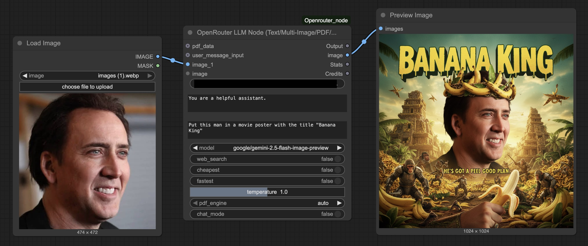

# ComfyUI OpenRouter Node

A custom node for ComfyUI that allows you to interact with OpenRouter's API, providing access to a wide range of models.  

## Updates

### 10/1/2026 - Image, Video and Audio Updates

- Added dedicated image models (including Flux) and model-supported image controls
- Added video generation to the existing node, with first/last frames, references, and job recovery
- Added audio input with validated WAV encoding and explicit service tiers for chat
- Fixed saved workflow compatibility, background model refresh, and API key serialization

Thanks @ArthurReboulSalze and @djdookie for the catalog/video and audio contributions.


### 5/18/2026

Reasoning effort setting added. Make sure the model supports reasoning when using

### 5/9/2026 - Secure API Key Loading

You can now load your API key from a JSON config or env var instead of typing it into the node, which avoids leaking it in workflow metadata when sharing images.

- **JSON config:** put `{"api_key": "your_key_here"}` in `openrouter_api_key.json` in the node directory, leave the field blank
- **Env var:** set `LLM_KEY`, leave the field blank
- **UI field:** still works if you don't share workflows


### 4/5/2026 - Seed, Resolution, Aspect Ratio, Temperature Fix
- Added **seed** input
- Added **image_resolution** dropdown (1K, 2K, 4K)
- Added **aspect_ratio** dropdown with all supported ratios, including Nano Banana 2 only extended ratios (1:4, 4:1, 1:8, 8:1)
- Fixed temperature slider
- 0.5K resolution (Nano Banana 2 only) not added - currently broken on OpenRouter's end, see [this thread](https://discord.com/channels/1091220969173028894/1484099048100073484/1484099048100073484) in the OpenRouter Discord




Multiple image inputs are supported. Make sure the model you are using supports multiple images to be sent at once. Thanks **@wTechArtist** for the idea!


### 9/5/2025 - Added image support for nano-banana and future image models

### 6/12/2025 - Chat Mode
Added a new Chat Mode feature that lets you store context to enable conversations with LLMs. When you enable chat mode, the node remembers your conversation history and maintains context between messages. Your chats are automatically saved in timestamped folders, so you can pick up where you left off if you come back within an hour. After that, it'll start a fresh conversation. Each chat session is stored as a JSON file with a friendly name based on your first message. Just toggle "chat_mode" 

## Features

- Current chat, image, and supported video models from OpenRouter's catalogs
- Support for multiple image inputs (up to 10 images) 
- **Image generation** - Dedicated OpenRouter Image API with current image models and supported settings
- Dynamic image input visibility - additional inputs appear as you connect images
- PDF support with multiple OCR engine options
- Web search capability with `:online` modifier
- Cheapest provider routing with `:floor` modifier
- Fastest provider routing with `:nitro` modifier
- Detailed statistics on token usage and generation speed
- Real-time OpenRouter account balance display
- **Chat Mode** - Maintain conversation context across multiple messages with automatic session management
- **Video generation** - Text, first frame, first/last frames, and image references with a native VIDEO output
- **Audio input** - Connect Load Audio to the optional audio_data input in chat mode
- **Background catalogs** - Model lists refresh without blocking ComfyUI

## Installation

1. Clone this repository into your ComfyUI custom_nodes folder:
```bash
cd ComfyUI/custom_nodes
git clone https://github.com/gabe-init/ComfyUI-Openrouter_node
```

2. Install the required dependencies:
```bash
pip install -r requirements.txt
```

3. Restart ComfyUI

## Usage

The OpenRouter node provides a simple interface to interact with various LLMs through the OpenRouter API.

### API Key Security

> [!WARNING]
> Prefer server-side key loading. This extension clears the key field from saved workflow widget values, but a manually entered key is still sent in the execution request and may appear in API-format prompts or other extensions' metadata. Check older workflows and exported files before sharing them.

To keep your API key secure, use one of the following methods:

1.  **JSON Config File (Recommended)**:
    - Create a file named `openrouter_api_key.json` in the node directory.
    - Add your key like this: `{"api_key": "your_key_here"}`.
    - Leave the **api_key** field blank in the ComfyUI interface.

2.  **Environment Variable**:
    - Set an environment variable named `LLM_KEY` on your system.
    - The node will automatically pick it up if the UI field is empty.

> [!NOTE]
> Key precedence is the nonempty UI field, then `LLM_KEY`, then `openrouter_api_key.json`. On Linux/macOS, restrict the JSON config with `chmod 600 openrouter_api_key.json` so only your user can read it.

### Inputs

#### Required Inputs:

- **api_key**: Your OpenRouter API key. Can be left blank if provided via `openrouter_api_key.json` or `LLM_KEY` environment variable.
- **system_prompt**: The system prompt that sets the behavior of the LLM.
- **user_message_box**: The user message to send to the LLM.
- **model**: The model to use for generation. The node fetches current models for the selected request type in the background. Refresh Models requests a fresh catalog without changing your selections.
- **web_search**: Enable web search capability by appending `:online` to the model ID. Search availability and pricing depend on the selected model and provider; check OpenRouter's current pricing.
- **cheapest**: Route to the cheapest provider by appending `:floor` to the model ID (enabled by default).
- **fastest**: Route to the fastest provider by appending `:nitro` to the model ID (disabled by default).
- **temperature**: Controls the randomness of the model's output (0.0 to 2.0).
- **reasoning_effort**: Controls OpenRouter's unified reasoning parameter. `auto` sends no override and lets OpenRouter/model defaults apply. `none` explicitly disables reasoning. `minimal`, `low`, `medium`, `high`, and `xhigh` request increasing reasoning effort where the selected model supports it.
- **chat_mode**: Enable conversation mode to maintain context across messages (disabled by default).
- **request_timeout**: HTTP connection/read timeout in seconds (default: 120). This detects stalled requests; it is not a strict wall-clock limit for DNS resolution or a response that keeps delivering data.

> [!NOTE]
> OpenRouter normalizes reasoning across providers, but behavior still depends on the selected model. Some providers map effort levels to token budgets, Gemini 3 maps effort to Google's thinking levels, `xhigh` may be mapped down when unsupported, and some reasoning models do not return visible reasoning tokens.

#### Optional Inputs:

- **request_type**: `chat` (default), `image`, or `video`. Existing workflows default to chat.
- **service_tier**: `auto` omits the override; `default`, `flex`, `priority`, and `ultrafast` explicitly request a chat service tier. Cheapest/fastest routing remains separate. Availability and pricing vary: models without flex endpoints use standard rates, while capacity errors on existing flex endpoints do not fall back to standard. Priority/ultrafast can fall back to standard. The returned tier appears in Stats. See [OpenRouter service tiers](https://openrouter.ai/docs/guides/features/service-tiers).
- **image_quality / image_background**: Image API controls filtered using the selected model's published capabilities. `auto` leaves the choice to the provider. Unsupported explicit settings fail before submission. GPT-5.4 Image2 does not advertise 1K/2K/4K resolution controls.
- **audio_data**: One native ComfyUI AUDIO clip, connected from Load Audio. Mono/stereo only; native audio is encoded as PCM16 WAV. Programmatic callers may also provide `{filename, bytes, format?}`. Empty data, unknown formats, unsupported batches/channels, and invalid samples are rejected. The selected chat model must support audio input; formats vary by provider.
- **video_mode**: `text_to_video` (no images), `first_frame` (one image), `first_last_frame` (two images), or `reference_images` (model-supported references). Connect one image per numbered input.
- **video_duration / video_resolution**: `auto` or a value supported by the chosen video model. Video uses the shared aspect-ratio and seed controls where supported.
- **video_generate_audio**: Request generated sound when the video model supports it.
- **video_wait_timeout**: Video wait budget in seconds, default 900. Polling and downloads check this deadline and shorten connection/read timeouts to the remaining budget; an in-progress DNS lookup or continuously arriving HTTP headers can still delay interruption.
- **video_job_id**: Resume an already-submitted job without paying for another submission. Copy the ID from Output or the error message. Recovery ignores the original prompt and media inputs.


- **image_1** through **image_10**: Multiple image inputs for multimodal models. The first image input (image_1) is always visible. Additional image inputs automatically appear as you connect images (up to 10 total).
- **pdf_data**: PDF document input for models that support document understanding.
- **pdf_engine**: Choose between "auto", "mistral-ocr", or "pdf-text" for PDF processing.
- **user_message_input**: Alternative input for the user message, useful for connecting to other nodes.

### Outputs:

- **Output**: The text response from the LLM.
- **image**: An image tensor if the response contains a generated image, otherwise returns an empty tensor.
- **Stats**: A string detailing tokens per second, input tokens, output tokens, temperature, and the model used.
- **Credits**: A string showing your remaining OpenRouter account balance (e.g., "Remaining: $9.792").
- **video**: Native ComfyUI VIDEO output, appended after the original four outputs. Connect it to Save Video. Video requires ComfyUI 0.3.31+ with PyAV; chat/image remain available on older installations.

Note: To display the output text in ComfyUI, you can use the ShowText nodes from [ComfyUI-Custom-Scripts](https://github.com/pythongosssss/ComfyUI-Custom-Scripts), but any text display node will work.

## Examples

### Basic Text Generation

1. Add the OpenRouter node to your workflow
2. Provide your API key (see [API Key Security](#api-key-security))
3. Set a system prompt (e.g., "You are a helpful assistant.")
4. Enter a user message (e.g., "Explain quantum computing in simple terms.")
5. Select a current chat model from the model list
6. Run the workflow

### Image Understanding

1. Add the OpenRouter node to your workflow
2. Connect an image output from another node to the "image_1" input
3. Provide your API key (see [API Key Security](#api-key-security))
4. Set a system prompt (e.g., "You are a helpful assistant.")
5. Enter a user message (e.g., "Describe this image in detail.")
6. Select a current chat model that supports image input
7. Run the workflow

### Multiple Image Analysis

1. Connect your first image to "image_1"
2. As soon as you connect it, "image_2" will automatically appear
3. Connect additional images as needed (one image per input; model limits apply)
4. Unused image inputs will automatically hide when disconnected
5. Enter a prompt that references multiple images (e.g., "Compare these images and describe the differences.")
6. Select a multimodal model that supports multiple images
7. Run the workflow

**Note**: The user is responsible for checking if their selected model supports multiple images. Most modern multimodal models (4o, Gemini Flash, etc.) support multiple images in a single request.

### Image Generation

1. Set **request_type** to `image` and select an image model.
2. Enter a prompt; connect image inputs for reference/editing requests where supported.
3. Choose supported aspect ratio, resolution, quality, or background settings, or leave them on `auto`.
4. Connect **image** to Preview Image or Save Image and run the workflow.

Image-only models use the dedicated [OpenRouter Image API](https://openrouter.ai/docs/guides/overview/multimodal/image-generation). Conversational models can still return images in chat mode. Settings differ by model; the node does not invent resolution support or promise exact dimensions from the old aspect-ratio labels.

### Video Generation

1. Set **request_type** to `video` and select a supported generation model.
2. Choose the video mode and connect the required numbered images.
3. Set supported duration, resolution, aspect ratio, and optional generated audio.
4. Connect **video** to Save Video and run the workflow.

The node submits once, waits for the job, then downloads and validates native video. It reports actual returned cost when available; no speculative estimate is shown. Editing/upscaling/avatar models requiring unsupported inputs are excluded.

Stopping ComfyUI or reaching the local timeout does not necessarily cancel the remote job. The node remembers the last accepted job in workflow properties; click **Resume Last Video** to fill **video_job_id**, then run again. You can also paste an ID from Output or the server log. Clear **video_job_id** before starting a new generation. If submission failed before returning an ID, check OpenRouter activity before submitting again. Downloads are limited to 512 MiB.

### Audio Input

Connect **Load Audio → audio_data**, select an audio-capable chat model, and enter an instruction such as “describe this audio.” One mono/stereo clip is accepted per run. Audio is only supported in chat mode.

### Chat Mode

The Chat Mode feature allows you to maintain conversation context across multiple messages, enabling more natural and coherent conversations with the LLM.

#### How Chat Mode Works:

1. **Enable Chat Mode**: Toggle the "chat_mode" option to True
2. **Automatic Session Management**: 
   - Sessions are automatically created when you start a conversation
   - If you send another message within 1 hour, it continues the same session
   - After 1 hour of inactivity, a new session is created
3. **Session Storage**:
   - Conversations are stored in a `chats` folder within the node directory
   - Each session is saved with a timestamp and the first 5 words of your initial message
   - Format: `session_YYYYMMDD_HHMMSS_first_five_words`
4. **Context Preservation**: The entire conversation history is sent with each request, allowing the model to maintain context

#### Chat Mode Example:

1. Enable chat_mode in the node
2. First message: "Hello, my name is Alice"
3. Response: "Hello Alice! Nice to meet you. How can I help you today?"
4. Second message: "What's my name?"
5. Response: "Your name is Alice, as you mentioned earlier."

The conversation history is automatically managed and persisted between runs.

#### Managing Chat Sessions:

A utility script `manage_chats.py` is included to help you manage your chat sessions:

```bash
# List all chat sessions
python manage_chats.py list

# View a specific session
python manage_chats.py view session_20241206_143022_hello_how_are_you_today

# Export a session to different formats (json, txt, md)
python manage_chats.py export session_20241206_143022_hello_how_are_you_today -f md -o my_chat.md

# Clean up sessions older than 30 days
python manage_chats.py clean -d 30
```

### Routing Options

- For cost-effective responses, enable the "cheapest" option (on by default)
- For faster responses, disable "cheapest" and enable "fastest"
- For web search capability, enable "web_search"

## Troubleshooting

- **Model list not loading**: Check your internet connection and click Refresh Models. Public catalog discovery does not require an API key; a failed refresh retains the last successful data.
- **Error in response**: Check the error message in the output. It might be due to an invalid API key, model unavailability, or other API issues.
- **Slow responses**: Try using the `:nitro` modifier by enabling the "fastest" option.
- **Token counting issues**: The node uses tiktoken for accurate token counting, but falls back to an estimation method if there's an issue.

## License

MIT License

Copyright (c) 2024 

Permission is hereby granted, free of charge, to any person obtaining a copy
of this software and associated documentation files (the "Software"), to deal
in the Software without restriction, including without limitation the rights
to use, copy, modify, merge, publish, distribute, sublicense, and/or sell
copies of the Software, and to permit persons to whom the Software is
furnished to do so, subject to the following conditions:

The above copyright notice and this permission notice shall be included in all
copies or substantial portions of the Software.

THE SOFTWARE IS PROVIDED "AS IS", WITHOUT WARRANTY OF ANY KIND, EXPRESS OR
IMPLIED, INCLUDING BUT NOT LIMITED TO THE WARRANTIES OF MERCHANTABILITY,
FITNESS FOR A PARTICULAR PURPOSE AND NONINFRINGEMENT. IN NO EVENT SHALL THE
AUTHORS OR COPYRIGHT HOLDERS BE LIABLE FOR ANY CLAIM, DAMAGES OR OTHER
LIABILITY, WHETHER IN AN ACTION OF CONTRACT, TORT OR OTHERWISE, ARISING FROM,
OUT OF OR IN CONNECTION WITH THE SOFTWARE OR THE USE OR OTHER DEALINGS IN THE
SOFTWARE.

## Credits

- [OpenRouter](https://openrouter.ai/) 
- [ComfyUI](https://github.com/comfyanonymous/ComfyUI) 
