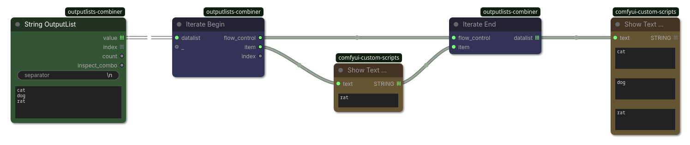

## Iterate End

(ComfyUI workflow included)

Iterate a sub-workflow by executing it from a data list sequentially in item-major order (as opposed to node-major)."
You need to connect the `flow_control` from a `IterateBegin` to a `IterateEnd` node.
Only use this if a sub-workflow takes a long time to process without any visible progress (see [execution stalling problem](https://github.com/geroldmeisinger/ComfyUI-outputlists-combiner#the-execution-stalling-problem)).
Make sure to use the passthrough output slots on output nodes (`Preview Image`, `Save Image` etc.) so the intermediate results are visible.
Internally uses the node expansion mechanism which duplicates the sub-workflow multiple times for each list item.

`lists` use(s) `is_output_list=True` (indicated by the symbol `𝌠`) and will be processed sequentially by corresponding nodes.

### Inputs

| Name | Type | Description |
| --- | --- | --- |
| `flow_control` | `FLOW_CONTROL` | Connect it to a `IterateBegin` node |
| `item` | `*` | You need to connect the `flow_control` from a `IterateBegin` to a `IterateEnd` node. |

### Outputs

| Name | Type | Description |
| --- | --- | --- |
| `datalist` | `* 𝌠` |  |
