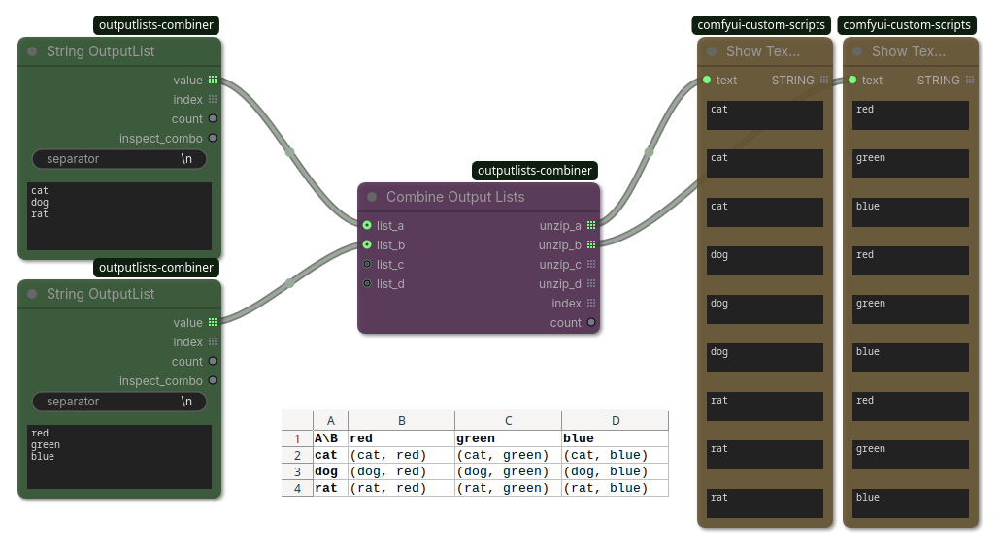

## OutputLists Combinations

(ComfyUI workflow included)

Takes up to 4 OutputLists and generates every combination of them.

Example: `[1, 2, 3] x ["A", "B"] = [(1, "A"), (1, "B"), (2, "A"), (2, "B"), (3, "A"), (3, "B")]`

`unzip_a` .. `unzip_d` use(s) `is_output_list=True` (indicated by the symbol `𝌠`) and will be processed sequentially by corresponding nodes.

All lists are optional and empty lists will be ignored.

Technically it computes *the Cartesian product* and outputs each combination splitted up into their elements (`unzip`), whereas empty lists will be replaced with units of `None` and they will emit `None` on the respective output.

Example: `[1, 2] x [] x ["A", "B"] x [] = [(1, None, "A", None), (1, None, "B", None), (2, None, "A", None), (2, None, "B", None)]`

Alternative usage: If you connect one list to a unit value it essentially works as a on-signal node (a.k.a execution order enforcer).

### Inputs

| Name | Type | Description |
| --- | --- | --- |
| `list_a` | `*` | (optional) |
| `list_b` | `*` | (optional) |
| `list_c` | `*` | (optional) |
| `list_d` | `*` | (optional) |

### Outputs

| Name | Type | Description |
| --- | --- | --- |
| `unzip_a` | `* 𝌠` | Value of the combinations corresponding to `list_a`. |
| `unzip_b` | `* 𝌠` | Value of the combinations corresponding to `list_b`. |
| `unzip_c` | `* 𝌠` | Value of the combinations corresponding to `list_c`. |
| `unzip_d` | `* 𝌠` | Value of the combinations corresponding to `list_d`. |
| `index` | `INT 𝌠` | Range of 0..count which can be used as an index. |
| `count` | `INT` | Total number of combinations. |
