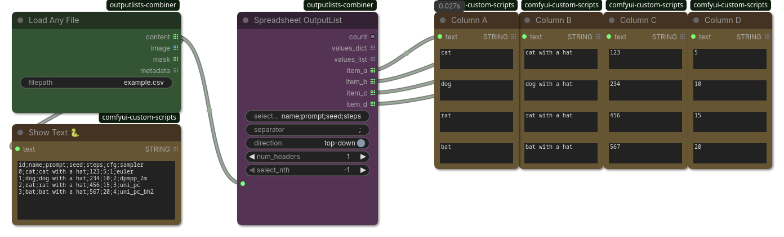

## Spreadsheet OutputList

(ComfyUI workflow included)

Creates multiple OutputLists from a spreadsheet (`.csv .tsv .md .ods .xlsx .xls`).
You can use the `Load any File` node to load a file in base64-encoding.
Internally uses *pandas* [read_excel](https://pandas.pydata.org/pandas-docs/stable/reference/api/pandas.read_excel.html) and [read_csv](https://pandas.pydata.org/pandas-docs/stable/reference/api/pandas.read_csv.html) to load spreadsheet files.
All lists use(s) `is_output_list=True` (indicated by the symbol `𝌠`) and will be processed sequentially by corresponding nodes.

Comments that start with `#` character in textfiles are ignored.

### Inputs

| Name | Type | Description |
| --- | --- | --- |
| `selectors` | `STRING` | A list of selectors separated by `separator` or empty list. The selectors can be names in the headers or column names (`A`, `B`, `C`...`ZZZZ`) or row indices (1...65536). Note that in spreadsheets rows start at 1, columns start at A, whereas OutputLists are 0-based (in `select-nth`). |
| `separator` | `STRING` | Separator character used for selectors and data in text files `(.csv .tsv .md)`. Supports escaping, e.g. `	` becomes tab character, `\` becomes backslash. |
| `direction` | `BOOLEAN` | Direction of iteration is either row-based (top-down) or column-based (left-to-right) |
| `num_headers` | `INT` | Treat the first x rows (or columns) in the spreadsheet as headers and skip them in the list. Uses the header as reference for row (or column) names. If direction=top-down searches the headers in bottom header row first (left-to-right, then iterating up). If direction=left-to-right searches the headers from rightmost header column first (top-down, then iterating left). |
| `select_nth` | `INT` | Only select the nth entry (0-based) or ignore if -1. Useful in combination with the `PrimitiveInt+control_after_generate=increment` pattern. |
| `string_or_base64` | `STRING` | CSV/TSV string or spreadsheet file in base64 (for `.ods .xlsx .xls`). Use `Load Any File` node to load a file as base64. |

### Outputs

| Name | Type | Description |
| --- | --- | --- |
| `count` | `INT` | Number of items in the longest list row (or column). |
| `values_dict` | `DICT 𝌠` | A dictionary using the selectors as keys and the values of the current row (or column). Useful in combination with `Format Text` node. Always includes both the selector and column name (or row index) as alias, if there is a header. |
| `values_list` | `ARRAY 𝌠` | A list of values of the current row (or column) based on the selectors. Useful in combination with `Format Text` node. |
| `item_a` | `STRING 𝌠` |  |
| `item_b` | `STRING 𝌠` |  |
| `item_c` | `STRING 𝌠` |  |
| `item_d` | `STRING 𝌠` |  |
