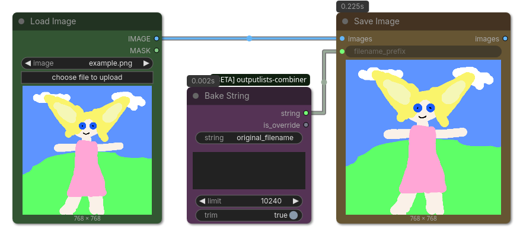

## Bake String

(ComfyUI workflow included)

Works as a simple string passthrough first but 'bakes' the string into the `override` field of the workflow JSON and then uses this value instead.

This node may seem strange but it allows to add additional infos on how a specific image was created in a multi-asset workflow.

* Use-case 1 "per-image paramters": If multiple images are created from an output list, the same workflow is stored for ALL images. This node allows to bake the specific string into the workflow JSON for the very string that was used in a individual image.
* Use-case 2 "include image": img2img and controlnet workflows require an input image. Used together with a base64 string the full image can be baked into the workflow JSON.

### Inputs

| Name | Type | Description |
| --- | --- | --- |
| `string` | `STRING` | The string that will be passed through unless `override` is set (lazy=True which means upstream nodes won't be executed if `override` is set) |
| `override` | `STRING` | If set, will always output this string instead. Used by `Save Image` (and other save nodes) to bake the value into the workflow JSON. |
| `limit` | `INT` | Limit of characters which will be baked into the field. |
| `trim` | `BOOLEAN` | Trims the `override` string of whitespace characters (like spaces and new lines) before doing the override-check. This prevents triggering the override when a new line was entered by accident. Only disable it if you actually need a whitespace string as an override. |

### Outputs

| Name | Type | Description |
| --- | --- | --- |
| `string` | `STRING` | If `override` is set, will use `override`, otherwise it's a passtrough of `string`. |
| `is_override` | `BOOLEAN` | A bool indicating if the override was used. Useful for If/Else Switches and Execution Blockers. |
