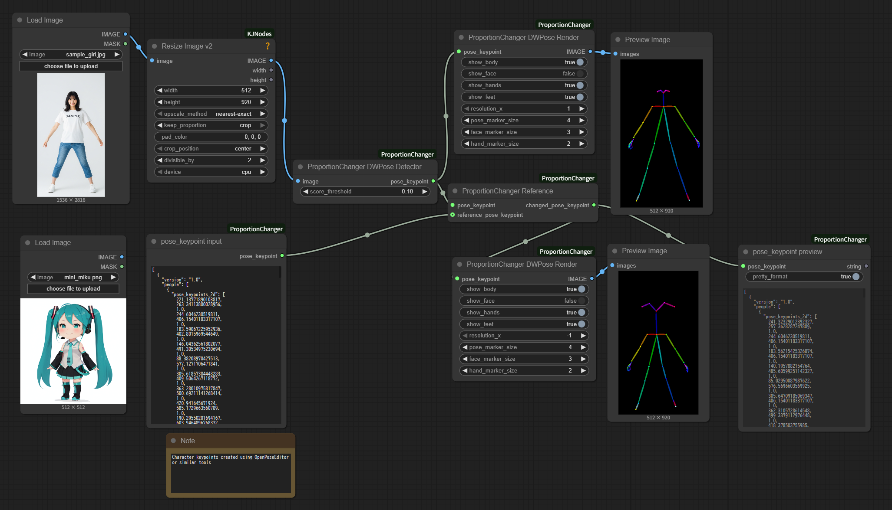

# ComfyUI-ProportionChanger

[日本語 README](README_ja.md) | English

> **Note**: This README was automatically generated using [Claude Code](https://claude.ai/code) AI-assisted development tools.

This custom node is created by decomposing and porting the WanVideo UniAnimate pose detector node from [kijai's ComfyUI-WanVideoWrapper](https://github.com/kijai/ComfyUI-WanVideoWrapper). The key difference is that instead of using image inputs, it now accepts KeyPoint data as input, enabling manipulation of body types that cannot be estimated by the pose detector alone.

Additionally, the Openpose Editor node from [toyxyz/ComfyUI-ultimate-openpose-editor](https://github.com/toyxyz/ComfyUI-ultimate-openpose-editor) has been similarly decomposed and ported, enabling fine-tuning of individual parts.

## Features

### Node Overview
- **ProportionChanger Pose Detector**: Detects KeyPoints from images
- **ProportionChanger Reference**: Transforms proportions to reference poses
- **ProportionChanger Pose Render**: Converts KeyPoints to images
- **ProportionChanger Params**: Adjusts parameters for individual KeyPoint parts, including separate upper/lower arm, thigh/lower-leg, and feet scaling
- **ProportionChanger Interpolator**: Interpolates KeyPoint videos with in-betweening
- **PoseData to pose_keypoint**: Converts WanAnimate `POSEDATA` into `POSE_KEYPOINT`
- **pose_keypoint resize**: Resizes `POSE_KEYPOINT` to a target size (pads then scales to avoid stretching when aspect differs)
- **pose_keypoint input**: Converts JSON text to KeyPoints
- **pose_keypoint preview**: Converts KeyPoints to JSON
- **(Down)Load Mascot Pose Model**: Downloads and loads a mascot pose ONNX model from HuggingFace
- **(Down)Load Mascot BBox Model**: Downloads and loads a mascot bbox ONNX model from HuggingFace
- **Mascot Pose Detector**: Detects mascot body pose as `POSE_KEYPOINT`
- **Mascot BBox Detector**: Detects mascot part bounding boxes as `BOUNDING_BOX`
- **pose_keypoint to SCAIL-Pose**: Converts 25-point `POSE_KEYPOINT` to SCAIL-Pose data

## Installation
### Install via ComfyUI Manager
1. Search for "ComfyUI-ProportionChanger" in ComfyUI Manager's Custom Nodes Manager and install

2. Restart ComfyUI

### Manual Installation

1. Clone this repository into your `custom_nodes` folder:
```bash
cd ComfyUI/custom_nodes
git clone https://github.com/grmchn/ComfyUI-ProportionChanger.git
```

2. Install dependencies:
```bash
cd ComfyUI-ProportionChanger
pip install -r requirements.txt
```

3. Restart ComfyUI

## Usage

### Basic Workflow

Please refer to example_workflows.



### Converting WanAnimate POSEDATA
- Use WanAnimatePreprocess "Pose and Face Detection" to produce `POSEDATA`
- Feed `POSEDATA`, `width`, and `height` into **PoseData to pose_keypoint**
- Connect the resulting `pose_keypoint` to ProportionChanger Reference / Render nodes
- Example workflow: `example_workflows/proportion_changer_pose_data_to_pose_keypoint.json`

### Converting to SCAIL-Pose
- Connect a changed `POSE_KEYPOINT` to **pose_keypoint to SCAIL-Pose**
- Use the resulting `DWPOSES` with SCAIL-Pose workflows
- Example workflow: `example_workflows/proportion_changer_SCAIL_pose.json`

## Troubleshooting

### Common Issues
1. **Model Loading Errors**: Models should be automatically downloaded from HuggingFace. Please ensure pose models are in the correct directory.
2. **Incorrect body proportions after transformation with reference image**: The `pose_keypoint` and `reference_pose_keypoint` aspect ratios (canvas width/height) may not match. **ProportionChanger Reference** has `auto_resize_reference` (default ON) to automatically align the reference to the pose canvas size. If needed, use **pose_keypoint resize** to explicitly align `width`/`height`. Fine-tune individual body parts using the "ProportionChanger Params" node.
3. **Nothing displays after transformation with reference image**: The reference image's pose estimation has failed. Use OpenposeEditor or similar tools to input parameter values manually.

### Mascot Pose Models

Mascot pose nodes download model artifacts from `grmchn/mascot-pose-detect` on HuggingFace into `ComfyUI/models/mascot_body_detect`. The official model package is Apache 2.0 and uses the `keypoint/dinov2_vitpose_l` variant. The node code remains part of this repository, and use of the downloaded models is subject to the model package license.

## Attribution and Credits
### Special Thanks
- **[kijai/ComfyUI-WanVideoWrapper](https://github.com/kijai/ComfyUI-WanVideoWrapper)**
- **[toyxyz/ComfyUI-ultimate-openpose-editor](https://github.com/toyxyz/ComfyUI-ultimate-openpose-editor)**

### License

This project is licensed under **GPL 3.0** due to the combination of source materials from different licenses:

- **Primary source**: [kijai/ComfyUI-WanVideoWrapper](https://github.com/kijai/ComfyUI-WanVideoWrapper) (Apache 2.0)
- **Secondary source**: [toyxyz/ComfyUI-ultimate-openpose-editor](https://github.com/toyxyz/ComfyUI-ultimate-openpose-editor) (GPL 3.0)

When combining code from Apache 2.0 and GPL 3.0 licensed projects, the resulting derivative work must be distributed under GPL 3.0 according to license compatibility rules.

### Copyright Notice

- Original WanVideo UniAnimate pose detector: Copyright by kijai
- ProportionChanger Params functionality: Copyright by toyxyz  
- Modifications and integration: This project's contributors

See the [LICENSE](LICENSE) file for the full GPL 3.0 license terms.
