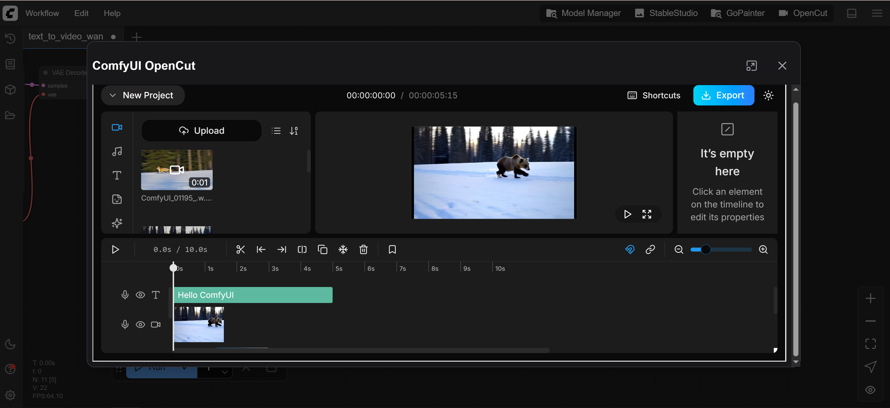

# ComfyUI-OpenCut

**[English](README.md) | [中文](README_CN.md)**

一个强大的、注重隐私的视频编辑器，直接集成到 ComfyUI 中。这个插件为您的 ComfyUI 工作流程带来专业的视频编辑功能，无需任何服务器端处理。



## 🌟 功能特性

### 核心编辑功能
- **多轨道时间线编辑器**：专业的时间线，支持多个视频、音频和叠加轨道
- **实时预览**：无需渲染即可即时预览编辑效果
- **拖放界面**：直观的媒体文件和时间线元素拖放操作
- **非破坏性编辑**：所有编辑都是非破坏性的，保留原始媒体文件

### 媒体支持
- **视频格式**：MP4、WebM、MOV、AVI 等
- **音频格式**：MP3、WAV、OGG、AAC
- **图像格式**：PNG、JPG、GIF、WebP
- **分辨率支持**：从标清到 4K 视频编辑

### 高级功能
- **关键帧动画**：为位置、缩放、旋转和不透明度添加动画
- **音频波形可视化**：在时间线上直接查看音频波形
- **吸附对齐**：磁性时间线吸附实现精确对齐
- **多种导出选项**：以各种格式和分辨率导出
- **撤销/重做系统**：完整的撤销/重做支持，配合键盘快捷键

### 布局与工作流
- **可自定义布局**：4 种预设布局，针对不同工作流程优化：
  - 默认：通用编辑的平衡布局
  - 媒体聚焦：更大的媒体面板，适合素材密集型项目
  - 检查器聚焦：扩展的属性面板，用于详细调整
  - 垂直预览：针对垂直视频编辑优化（抖音、Instagram Reels）
- **可调整大小的面板**：拖动调整任何面板大小以适应您的偏好
- **键盘快捷键**：全面的键盘快捷键支持，提高编辑效率

### 隐私与性能
- **100% 客户端处理**：所有视频处理都在您的浏览器中使用 WebAssembly 进行
- **无需上传**：您的媒体文件永远不会离开您的计算机
- **FFmpeg 集成**：由 FFmpeg.wasm 提供专业级处理能力
- **IndexedDB 存储**：项目本地保存在您的浏览器中
- **OPFS 支持**：使用 Origin Private File System 高效存储大文件

## 📦 安装

### 前置要求
- ComfyUI（推荐最新版本）
- 现代网络浏览器（Chrome、Firefox、Edge、Safari）
- 至少 4GB 可用内存用于视频处理

### 安装步骤

1. 导航到您的 ComfyUI `custom_nodes` 目录：
   ```bash
   cd /path/to/ComfyUI/custom_nodes
   ```

2. 克隆此仓库：
   ```bash
   git clone https://github.com/[your-repo]/ComfyUI-OpenCut.git
   ```

3. 安装依赖（如果有）：
   ```bash
   cd ComfyUI-OpenCut
   pip install -r requirements.txt  # 如果存在 Python 依赖
   ```

4. 重启 ComfyUI

## 🚀 使用方法

### 方法 1：直接浏览器访问
打开浏览器并导航到：
```
http://127.0.0.1:8188/opencut/
```

### 方法 2：ComfyUI 界面（需要 ComfyUI 前端 v1.24.4+）
1. 在浏览器中打开 ComfyUI
2. 在界面中寻找"OpenCut"按钮
3. 点击在新标签页中启动视频编辑器

## 🎬 快速入门

### 创建您的第一个项目
1. 使用上述方法之一启动 OpenCut
2. 点击"新建项目"或直接将媒体文件拖放到界面上
3. 您的媒体将出现在媒体面板（左侧）
4. 将媒体从面板拖到时间线上开始编辑

### 基本编辑工作流程
1. **导入媒体**：拖动文件或点击媒体面板中的"上传"
2. **添加到时间线**：将媒体拖到所需的轨道和位置
3. **修剪片段**：悬停在片段边缘并拖动以修剪
4. **添加过渡**：重叠片段以创建自动过渡
5. **调整属性**：选择一个片段并使用属性面板调整设置
6. **预览**：使用空格键播放/暂停您的编辑
7. **导出**：点击导出并选择所需的格式和质量

### 键盘快捷键
- `空格`：播放/暂停
- `S`：在播放头位置分割片段
- `Delete`：删除选中的元素
- `Ctrl/Cmd + Z`：撤销
- `Ctrl/Cmd + Shift + Z`：重做
- `Ctrl/Cmd + C/V`：复制/粘贴
- `[` / `]`：设置入点/出点
- `方向键`：逐帧导航

## 🎨 布局预设

### 切换布局
点击标题栏中的布局按钮在预设之间切换：

- **默认布局**：所有面板可见的平衡视图
- **媒体布局**：放大的媒体面板，便于浏览大量素材
- **检查器布局**：扩展的属性面板，用于详细编辑
- **垂直布局**：针对 9:16 垂直视频优化

### 自定义面板大小
- 拖动面板之间的分隔线来自定义大小
- 您的自定义大小会按布局预设保存
- 点击重置按钮恢复默认大小

## 🔧 高级功能

### 项目管理
- 项目自动保存到浏览器存储
- 将项目导出/导入为 JSON 文件以进行备份
- 可以从项目页面管理多个项目

### 媒体处理
- 自动为视频生成缩略图
- 为音频轨道生成波形
- 智能代理生成，实现大文件的流畅播放

### 导出选项
- **格式**：MP4、WebM、MOV
- **分辨率**：原始、1080p、720p、480p
- **质量**：高、中、低
- **帧率**：24、30、60 fps
- **音频**：立体声/单声道，各种比特率

## 🐛 故障排除

### 常见问题

**媒体无法加载：**
- 确保文件是支持的格式
- 检查浏览器控制台是否有错误
- 尝试刷新页面

**播放卡顿：**
- 在设置中降低预览分辨率
- 关闭其他浏览器标签页
- 确保有足够的可用内存

**导出失败：**
- 检查可用的浏览器存储空间
- 尝试较低的分辨率/质量设置
- 确保没有损坏的媒体文件

**布局不改变：**
- 清除浏览器缓存
- 检查 localStorage 是否启用
- 尝试重置为默认布局

### 浏览器要求
- Chrome 90+、Firefox 89+、Safari 15+、Edge 90+
- 需要 WebAssembly 支持
- 推荐 SharedArrayBuffer 支持
- 推荐至少 4GB 内存

## 🤝 贡献

欢迎贡献！请随时提交问题和拉取请求。

### 开发设置
1. 克隆仓库
2. 安装依赖：`bun install`
3. 运行开发模式：`bun dev`
4. 构建生产版本：`bun run build:comfyui`

## 📝 许可证

此项目集成了 OpenCut，最初由 [OpenCut-app](https://github.com/OpenCut-app/OpenCut) 开发。请参阅原始项目了解许可信息。

## 🙏 致谢

- 原始 OpenCut 开发者，感谢他们创造了这个出色的视频编辑器
- ComfyUI 团队提供了可扩展的平台
- FFmpeg.wasm 提供客户端视频处理
- 所有贡献者和此集成的用户

## 📞 支持

对于特定于 ComfyUI 集成的问题，请在此仓库中开启一个 issue。
对于 OpenCut 特定的问题，请参考[原始 OpenCut 仓库](https://github.com/OpenCut-app/OpenCut)。

---

**注意**：此集成正在积极开发中。某些功能可能是实验性的或可能会发生变化。