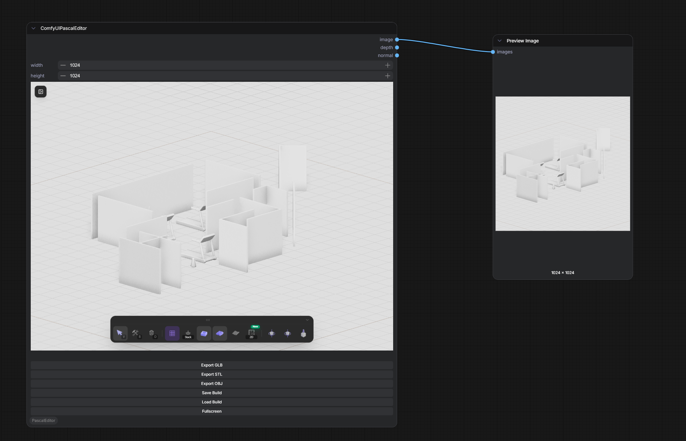

# ComfyUI-PascalEditor

A ComfyUI plugin that integrates [Pascal Editor](https://github.com/pascalorg/editor) — a full-featured 3D architectural editor — directly into your ComfyUI workflow.

[中文说明](README_CN.md)



## What's New (v0.4.0)

This release updates the bundled Pascal Editor from `0.6.0` to upstream **[v0.9.1](https://github.com/pascalorg/editor)**, bringing four minor versions of editor improvements into the ComfyUI plugin:

- **Paint slots material system v2** — per-slot painting (slab top/side split), dynamic material library with browse categories and create-in-place scene materials
- **Vertical building model** — stored level heights, wall inversion, and decks
- **Group manipulation** — Photoshop-style multi-selection move, rotate, and duplicate
- **Placement & interaction overhaul** — FSM-driven placement, mode-aware snapping for walls/fences/roofs/stairs/MEP, contextual HUD
- **Baked GLB export** — animation clips baked in (doors, fans), GLB walkthrough viewer with LOD, texture-reference export mode
- **Floorplan upgrades** — multi-page PDF export per level, construction documentation, much faster navigation
- **Measurement tools** — production measurement tools, natural-language measurement inputs, metric/imperial honored in every length input
- **Rendering & lighting pass** — sun-dominant look, sky backdrop, grounded horizon
- **Plugin system** — plugin contract + first-party Nature pack (trees, flowers, grass)
- **Walkthrough improvements** — crouch, wider FOV, tuned walk/run/jump speeds, unified viewer UI
- New door open-animations (sliding/garage/folding/pocket/barn), horizontal-board fence style, SFX, and hundreds of fixes

Note: upstream's cloud scene API and realtime collaboration are server features and are not part of this static in-ComfyUI build.

Plugin-side changes:

- Scene load/save now goes through upstream's build JSON validation and keeps installed-plugin state; loading correctly resets undo history
- The editor's new `fonts/`, `hdri/`, and `material/` asset roots are now served by the plugin routes

## Features

- **Full 3D Architectural Editor** — Create and edit buildings, walls, floors, ceilings, roofs, doors, windows, stairs, fences, and zones directly in a ComfyUI node
- **Screenshot Output** — Automatically captures the current 3D viewport as an IMAGE output when running the workflow, ready for img2img, ControlNet, etc.
- **Configurable Resolution** — Width/height controls on the node determine the output image size (center-crop + LANCZOS scaling, no distortion)
- **3D Model Export** — Export your designs as GLB, STL, or OBJ via node buttons
- **Scene Save & Load** — Save your building layout as JSON and reload it later
- **Fullscreen Mode** — Open the editor in a fullscreen dialog for a better editing experience
- **Top Menu Access** — Quick access button in the ComfyUI top menu bar
- **Collapsible UI** — Sidebar and toolbar can be collapsed/dragged for maximum viewport space

## Installation

Clone this repository into your ComfyUI `custom_nodes` directory:

```bash
cd ComfyUI/custom_nodes
git clone https://github.com/jtydhr88/ComfyUI-PascalEditor.git
```

Restart ComfyUI. The **Pascal Editor** node will appear under the `PascalEditor` category.

## Usage

### As a Node

1. Add the **Pascal Editor** node to your workflow
2. Design your building in the embedded 3D editor
3. Connect the `image` output to downstream nodes (e.g., Preview Image, img2img, ControlNet)
4. Run the workflow — the current viewport is automatically captured and output

### Node Buttons

| Button | Action |
|--------|--------|
| Export GLB | Download the 3D model in GLB format |
| Export STL | Download the 3D model in STL format |
| Export OBJ | Download the 3D model in OBJ format |
| Save Build | Save the current scene as a JSON file |
| Load Build | Load a previously saved JSON scene |
| Fullscreen | Open the editor in a fullscreen dialog |

### Top Menu

Click the **Pascal Editor** button in the ComfyUI top menu bar to open the editor in a fullscreen dialog.

### Direct URL

Access the editor directly at: `http://127.0.0.1:8188/pascal-editor/`

## Development

### Prerequisites

- Node.js 18+
- [Bun](https://bun.sh) package manager

### Build the Plugin Extension

```bash
cd ComfyUI/custom_nodes/ComfyUI-PascalEditor
npm install
npm run build
```

### Rebuild the Editor UI

The `pascal-editor-ui/` directory contains the pre-built editor. To rebuild from source, check out the `feat/comfyui-plugin-v3` branch of [pascalorg/editor](https://github.com/pascalorg/editor) and run:

```bash
bun install
bun scripts/build-comfyui.mjs
```

Then copy `apps/editor/out/` over this plugin's `pascal-editor-ui/` directory.

## Credits

This plugin integrates [Pascal Editor](https://github.com/pascalorg/editor) by [Pascal](https://github.com/pascalorg) — an open-source 3D architectural editor built with React Three Fiber, Three.js, and Next.js.

## License

MIT
