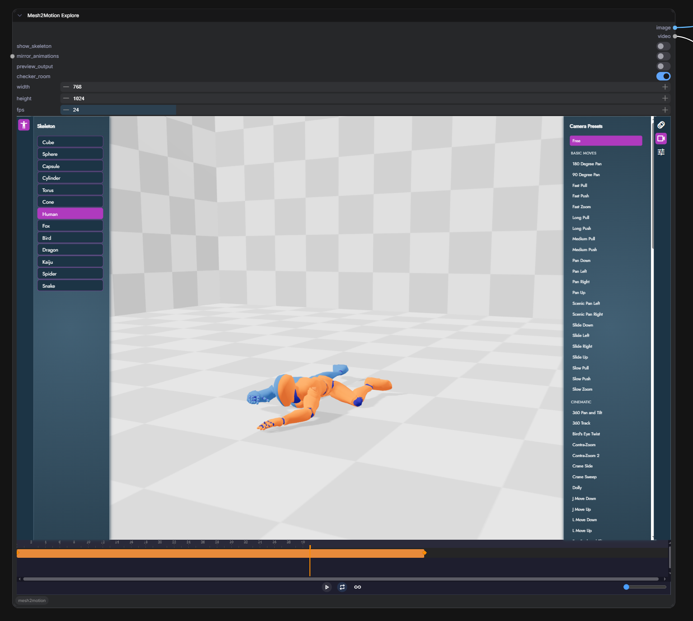
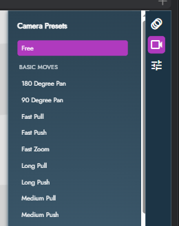
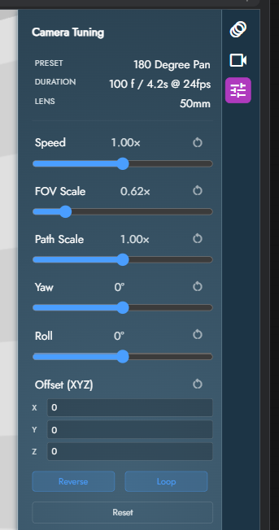

# ComfyUI-mesh2motion

<div align="center">

[English](./README.md) | 简体中文

</div>

一个 ComfyUI 自定义节点，把深度改造过的
[Mesh2Motion](https://mesh2motion.org) 作为可交互的 3D 编辑器直接嵌进
节点里面。选骨架、选运镜、调整画面，节点就会输出一个 `IMAGE`（单帧）
和一个 `VIDEO`（运镜录制），直接流转到 ComfyUI 工作流里。

https://github.com/user-attachments/assets/11b87a68-32d7-45ba-b59c-4a6bb950310b

---

## 相对上游的变化

这是对原插件的一次深度重写。如果你之前用过老版本，注意以下几点：

- **只剩一个主节点。** 节点内编辑全部走一个 `Mesh2Motion Explore`
  节点；之前的 `Create` / `Preview` / `Save` 节点都去掉了。
- **右键 / 顶部菜单打开的是独立的"窗口"编辑器。** 1.1.0 起又把轻量
  dialog 加回来了，但它走自己的 page（`index-comfyui-window.html` /
  `create-comfyui-window.html`），跟节点模式的代码路径完全隔离，两边
  不会互相影响 DOM 或 bridge 状态。不再依赖 Vue / PrimeVue runtime ——
  纯 DOM modal。
- **节点模式所有 UI 搬进 iframe。** 骨架选择、相机预设浏览、调参、
  时间轴 —— 所有用户需要的控件都在嵌入的编辑器里。
- **完整的状态持久化。** 用户选的、调的所有东西都存进 `node.properties`，
  重新打开工作流时原样恢复。
- **`VIDEO` 输出是一等公民。** 节点直接输出 `VIDEO`（webm 在后端经
  PyAV 解码），不用再接单独的 frame-list 节点。

---

## 安装

```bash
cd ComfyUI/custom_nodes
git clone https://github.com/jtydhr88/ComfyUI-mesh2motion.git
```

重启 ComfyUI。不需要额外安装 Python 依赖 —— 需要的要么已经打包进去，
要么 ComfyUI 自己就有。

---

## Mesh2Motion Explore 节点



### Widget 说明

| Widget | 类型 | 用途 |
|---|---|---|
| `show_skeleton` | bool | 在网格上叠加骨骼辅助显示 |
| `mirror_animations` | bool | 沿骨架的对称平面镜像动画 |
| `preview_output` | bool | 叠加一个跟 `width`/`height` 比例一致的裁剪框，让你提前看到实际会被捕获的画面 |
| `checker_room` | bool | 给场景加一个棋盘格房间，让渲染对 AI 更"友好" |
| `width` / `height` | int | IMAGE 和 VIDEO 的输出分辨率 |
| `fps` | int | 写进 VIDEO 的帧率（时间轴按预设原生节奏播放，这个只影响编码时的帧率元数据） |

### 输出

| 输出 | 什么时候会有值 |
|---|---|
| `IMAGE` | 总是有 —— 当前时间点在 viewport 里的单帧截图 |
| `VIDEO` | 激活相机预设时 —— 整段运镜渲染出的 webm |

---

## 使用指引

### 1. 拖节点、打开编辑器

从节点菜单（`3d/mesh2motion` 分类下）加入 `Mesh2Motion Explore`。节点
会直接在原地渲染出一个可交互的 3D 编辑器 —— 不需要另开窗口或弹窗。

### 2. 选骨架（左侧）


左边的 **activity bar** 有个按钮可以展开 **Skeleton** 面板。分两部分：

- **Primitives** —— cube / sphere / capsule / cylinder / torus / cone。
  方便不加载角色直接测相机路径，或者当背景元素用。
- **Character rigs** —— Human、Fox、Bird、Dragon 等。每个 rig 自带
  一套兼容的动画。

选中角色后会加载对应的 rig、默认网格和动画库（右边面板 → Animations）。

### 3. 选动画（右侧 → Animations）


点右侧 activity bar 第一个按钮展开。动画列表会按当前骨架类型过滤。
点一下把它加载到网格上，时间轴上会出现一条动画轨道。

### 4. 选相机预设（右侧 → Camera Presets）



右侧 activity bar 第二个按钮。**116 个预设**，按意图分成 8 个大类：

- **Basic Moves** —— 平移、滑动、推拉、变焦
- **Cinematic** —— 轨道车、升降、360 环绕、J/L 镜头、鸟瞰
- **Handheld** —— 手持静态/切换、手持变焦、轻微左右张望
- **Speed Ramps** —— 带戏剧加速的推 / 拉 / 扭
- **Locomotion** —— 走、跑（前后左右）
- **Vehicle** —— 车辆飞过、喷气机、直升机、无人机
- **Action** —— 导弹冲击、爆炸、枪击、退缩、坠落
- **Abstract** —— 太空漂浮、旋转、醉感

点一下立即开始播放运镜。顶上点 **Free** 回到自由 orbit 控制（没有
激活的预设）。

### 5. 调整预设（右侧 → Camera Tuning）



右侧 activity bar 第三个按钮。有激活的预设时，这里会显示预设的
元信息和一组调参控件。

**元信息（只读）**
- 预设名
- 时长（frames / 秒 @ fps）
- 镜头范围 —— 带 ⚡ 标记表示这个预设在中途会动态改焦距
  （Contra-Zoom / Dolly-Zoom 这类）

**调参控件**

| 控件 | 作用 | 默认 |
|---|---|---|
| **Speed** | 播放速度倍数（0.25× – 4×） | 1× |
| **FOV Scale** | 对每帧焦距做倍数；> 1 收窄 FOV（推近） | 1× |
| **Path Scale** | 以被摄物为中心对整条相机路径做缩放。< 1 靠近、> 1 远离。烘焙好的旋转依然有效，因为 camera→subject 的方向保持不变 | 1× |
| **Yaw** | 绕被摄物的竖轴旋转路径。把"正面推"变成"侧面推" | 0° |
| **Roll** | 荷兰角 —— 沿相机自身的前向轴旋转 | 0° |
| **Offset (XYZ)** | 给每一帧的位置加一个刚性的世界空间平移（Three.js Y-up），不动旋转 | (0, 0, 0) |
| **Reverse** | 倒放 | 关 |
| **Loop** | 和时间轴的循环开关同步 | 开 |

每个控件旁边有 **↻** 单独重置该项。底部的 **Reset** 清空全部。

调参按**预设**持久化 —— 下次再选同一个预设会恢复上次的设置。

### 6. 用时间轴


- **相机轨道（蓝色）** —— 激活预设的范围。右端点（实蓝）可拖拽，拖
  它改播放速度。左端点（淡蓝）固定在 frame 0。
- **动画轨道（橙色）** —— 当前模型动画。整条拖动调节动画在时间轴里
  的偏移。拖左右端点改速度。
- **播放头** —— 横向拖动擦洗，或者点任意位置跳转。

时间轴下方的播放栏：

| 控件 | 作用 |
|---|---|
| ▶ / ❚❚ | 播放 / 暂停 |
| 🔁 Timeline Loop | 播放头走到相机范围末尾时从头再来。关闭则停在末尾 |
| ♾ Model Anim Loop | 打开后动画在自己范围内循环播放。时间轴可视化会把动画条平铺在整个相机长度上 —— 实心橙是原始一次、淡橙是 loop 复制 |
| Zoom 滑块 | 时间轴横向缩放（也支持在时间轴上 Ctrl + 滚轮） |

### 7. 设输出尺寸、排队

在节点上设 `width`、`height`、`fps`，点 Queue Prompt。节点产出：

- `IMAGE` —— 播放头位置的单帧
- `VIDEO` —— 整段运镜，用目标分辨率离屏渲染

Video 有缓存：重排队但没改任何影响渲染帧的输入时会直接跳过渲染，
重复运行是秒出的。

#### 视频编码：WebCodecs 与 MediaRecorder 回退

编辑器默认用 WebCodecs `VideoEncoder` 录制视频 —— 它是确定性的
（直接从 WebGL backing buffer 逐帧取，不走 compositor），而且明显比
浏览器里其他方案都快。有它就用它。

但 `VideoEncoder` 在某些环境里没有，所以编辑器会自动回退到同一 canvas
上的 `MediaRecorder` 路径。已知会触发回退的情况：

- **Safari < 17** —— `VideoEncoder` 在 Safari 17 才开始支持。
- **老版本 Firefox** —— WebCodecs 编码能力在 Firefox 130+ 才算基本可用。
- **部分浏览器里的非安全上下文** —— 例如用 `http://192.168.x.x:8188`
  这种局域网 IP 访问 ComfyUI。Localhost 和 `127.0.0.1` 算 Secure
  Context，WebCodecs 能用。修法是改 HTTPS 或走 localhost。

回退路径产生的 webm 形状一样（分辨率、帧数、fps 都一致），但明显
更慢，因为每一帧都要经过浏览器的 compositor 才能到达 recorder。
**如果你觉得录制慢，就是这个原因** —— 对照上面的清单，有条件的话
切到 HTTPS 或 localhost 把 WebCodecs 这条路拿回来。

---

## 窗口模式（右键 / 顶部菜单）

不是所有工作流都适合在节点里嵌 iframe —— 有时候你就是想把完整编辑器
悬浮在图上，打一个 pose 或者出张参考图。窗口模式把 Mesh2Motion 作为
一个模态 dialog 铺在 ComfyUI 上方，关闭时会把结果像你自己上传了一样
回写到某个 ComfyUI 节点。它不会往工作流图里加任何东西 —— 就是一次性
的编辑器交互。

### 入口

- **顶部 `Mesh2Motion` 按钮。** 追加在 ComfyUI 菜单的 settings 组里，
  点击打开 Explore 页面。
- **右键 → "Open in Mesh2Motion"。**
  - `LoadImage` 上：打开 Explore 页面。保存的图片回写到这个节点。
  - `Load3D` / `Preview3D` / `SaveGLB`（以及任何 widget 里保存的是
    `.glb` / `.gltf` / `.fbx` / `.obj` 文件的节点）：打开 Create
    页面，并预加载这个节点当前的模型。

### Dialog 上的元素

模态顶部有四块：

- **标题** —— 标明当前是 Explore 还是 Create。
- **状态行** —— 加载 / 导出进度和错误信息。
- **Save Image** —— 触发图片导出（Explore 流程）。
- **Save Model** —— 触发 GLB 导出（Create 流程）。
- **✕** —— 不保存关闭。点模态外的暗色区域也是关闭。

### Explore 流程：骨架 + 动画 → 图片回写 LoadImage

1. 从顶部 `Mesh2Motion` 按钮打开，或者右键一个 `LoadImage` 节点打开。
2. 在左边模型列表里选一个角色（Human / Fox / Bird / Dragon）。
3. 在右边动画列表里选一个动画。底部播放条可以擦洗到任意一帧。
4. 用鼠标调整相机（左键拖 = 旋转、右键拖 = 平移、滚轮 = 缩放）。
5. 点 **Save Image**。iframe 里会弹出一个裁剪浮层 —— 拖 / 缩放
   框选出想要的画面，然后确认。
6. PNG 会上传到 ComfyUI 的 `input/mesh2motion/` 目录，路径写回到
   原 `LoadImage` 节点的 widget（如果是从顶部按钮打开的，就写到
   graph 上第一个 `LoadImage`）。节点预览图立刻刷新。

### Create 流程：给 3D 模型绑骨 → GLB 回写源节点

1. 右键一个带 3D 模型的节点（`Load3D` / `Preview3D` / `SaveGLB`，
   或任何 widget 值以 `.glb` / `.gltf` / `.fbx` / `.obj` 结尾的节点）。
2. Dialog 打开到 Create 页面，模型已预加载。如果想从头来，改走顶部
   `Mesh2Motion` 按钮，再从 dialog 内的 nav 切到 Create。
3. 用 `X` / `Y` / `Z` 按钮把模型转到正面朝前，必要时把它抬回地面，
   再选一个跟它解剖结构匹配的骨架模板。
4. 进入 **Edit Skeleton**：把每根骨头拖到位。Preview 切换可以在带贴图
   和权重涂色之间来回看，用复选框镜像左右关节。
5. **Bind pose** 确认骨架，然后从列表里选动画。A-pose 校正和按动画
   勾选都在右侧面板。
6. 点 **Save Model**。绑完骨带动画的 GLB 会上传到 ComfyUI 的
   `input/mesh2motion/` 目录，原节点的 widget 会自动指向新路径。

### 实现说明

窗口模式刻意走跟节点嵌入编辑器不一样的页面
（`index-comfyui-window.html` / `create-comfyui-window.html`），两边
永远不会共用 DOM 钩子或 bridge 状态。Dialog 通过一个小的 `comfyui:*`
postMessage 协议（`loadModel` / `requestExport` / `requestImageExport` /
`setTheme`）和 iframe 通信。

---

## 更新日志

### 1.2.0 — 2026-05-07

- **自定义 FBX 导入。** 用户可以直接在编辑器里上传自包含的 FBX 资源
  （mesh + 骨骼 + 动画打包在同一个文件里，例如 Mixamo 下载的文件）：
  点左侧活动栏的上传按钮、选个 `.fbx`，文件就以按钮形式出现在模型选择
  面板里。插件从 `<comfyui>/input/mesh2motion/customs/` 提供文件。
  加载时按 bbox 归一化，让模型大小落在内置人体骨架附近，不管源文件
  用的是什么单位。
- **支持 multi-mesh / multi-take 的 FBX。** Mixamo 角色拆成 body +
  hands + fingers + ... 多个 mesh 的现在可以正确播放（之前每个 mesh
  一个 action 的绑定方式会静默丢掉大部分 track）。多个 take 的 FBX
  把每个 clip 都列在右侧动画面板里；通用 / 重名（`mixamo.com`、
  `Take 001` 等）会被重写成 `Take N`，每条都能区分。
- **自定义 FBX 选择会被持久化。** 选的 FBX 文件名跟骨骼选择一样存进
  ProjectState；重新加载 workflow 会恢复同一个 actor。

### 1.1.0 — 2026-04-22

- **窗口模式回归。** 右键 `LoadImage` / `Load3D` / `Preview3D` /
  `SaveGLB` → "Open in Mesh2Motion" 打开轻量的纯 DOM modal（没有
  Vue / PrimeVue 依赖）。ComfyUI 顶部菜单里也加了一个 `Mesh2Motion`
  按钮。走自己的 `*-comfyui-window.html` 页面，节点模式和窗口模式
  永远不共用状态。
- **视频录制支持 MediaRecorder 回退。** `WebCodecs.VideoEncoder`
  不可用时（Safari < 17、老 Firefox、用 HTTP 通过局域网 IP 访问
  ComfyUI 这类非安全上下文），编辑器自动降级到 `MediaRecorder`。
  比 WebCodecs 慢，但凡是 `MediaRecorder` 能跑的地方视频输出都能跑。
- **视频缓存签名覆盖所有 tune 面板编辑项。** 改 FOV Scale / Reverse /
  Path Scale / Yaw / Roll / XYZ Offset 现在都会正确让缓存失效，下次
  Queue 重新渲染。之前只有 Speed 生效（因为它挂在 timeline 条目里），
  其他这几项会被默默忽略，节点返回旧视频。

### 1.0.0

- 从"多节点 + Vue dialog"的布局重写成"单个 `Mesh2MotionExplore` 节点
  + 嵌入 iframe"。
- 用 `node.properties` 做完整状态持久化 —— 骨架、相机预设、每预设
  调参、时间轴状态、面板开关、时间轴缩放。
- 一等公民的 `VIDEO` 输出，WebCodecs 确定性录制，`fps` 可配置，基于
  输入哈希的缓存让"什么都没改就重排队"时直接跳过渲染。
- 相机预设包打包进构建（8 个意图分类下共 116 个预设）+ 调参面板
  （Speed / FOV Scale / Path Scale / Yaw / Roll / Offset / Reverse /
  Loop）。

---

## 协议

MIT

## 致谢

- [Mesh2Motion](https://mesh2motion.org) by Scott Petrovic ——
  本插件基于的 3D 绑骨和动画工具
- [ComfyUI](https://github.com/comfyanonymous/ComfyUI) —— 工作流
  平台
- [animation-timeline-js](https://github.com/ievgennaida/animation-timeline-control)
  —— 基于 canvas 的时间轴控件
