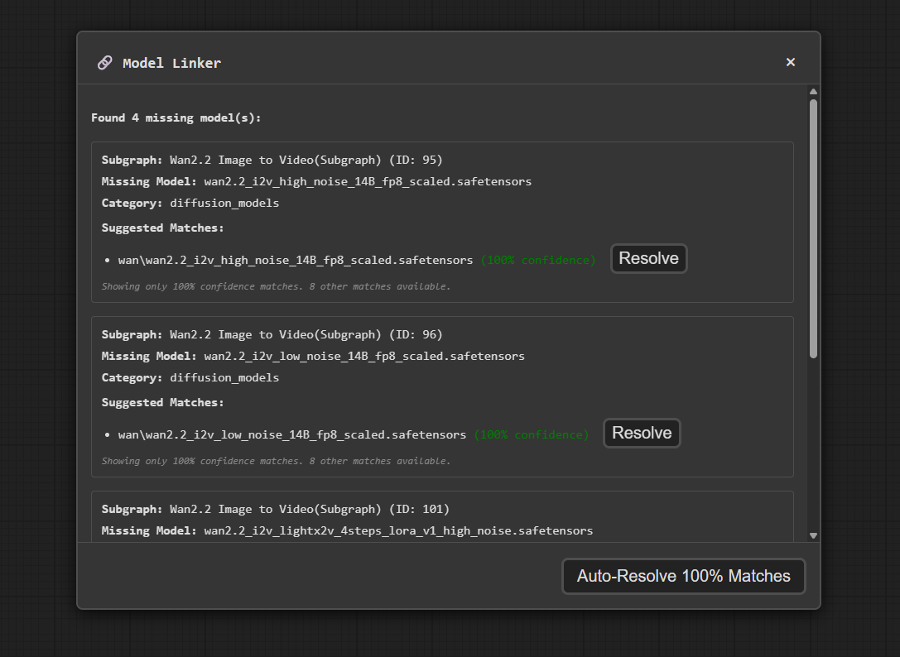

# ComfyUI Model Linker

A ComfyUI extension that relinks missing models in shared workflows: it finds the closest matches among your local files using fuzzy matching, and can download what you don't have from HuggingFace or CivitAI.

https://github.com/user-attachments/assets/fedf3645-aa66-49f7-b01d-8c3b5127faf4

## Features

- **Workflow scanning** — finds model references in all nodes, including nested subgraphs
- **Custom node support** — detects model fields of third-party loader nodes automatically by introspecting their input definitions; no hardcoded node list
- **Fuzzy matching** — intelligent similarity scoring finds files despite renames, different separators, or capitalization; 100% matches shown first, otherwise best matches ≥70% confidence
- **Cross-platform paths** — workflows authored on Windows match on Linux and vice versa (`\` vs `/` is handled)
- **Folder-aware suggestions** — a file sitting in a folder the node can't load from is flagged with a "wrong folder" warning instead of silently failing at prompt time
- **Auto-resolve** — one click links every perfect match; also available directly from ComfyUI's native Missing Models popup
- **Browse & swap** — the All models tab lists every model in the workflow grouped by category; swap any of them for another local file without hunting through the node tree, applied to all referencing nodes at once
- **Downloads** — fetches missing models from HuggingFace/CivitAI (URLs from the workflow, a model database, or online search), with progress, speed display, bulk download, and cancel
- **Safe updates** — resolved models are applied to the live graph in place (no canvas rebuild); you save the workflow yourself when ready

## Installation

1. Clone or download this repository
2. Place it in your ComfyUI `custom_nodes/` directory
3. Restart ComfyUI

## Usage

1. Open a workflow with missing models
2. Open the Model Linker via the button in ComfyUI's top menu bar, the `Ctrl+Shift+L` shortcut, or the button injected into ComfyUI's Missing Models popup
3. Review missing models and their suggested matches
4. Link individual matches, use **Auto-Link** for all 100% matches, or **Download All Missing** for models with known sources
5. Save your workflow when ready

## License

[MIT](LICENSE)
