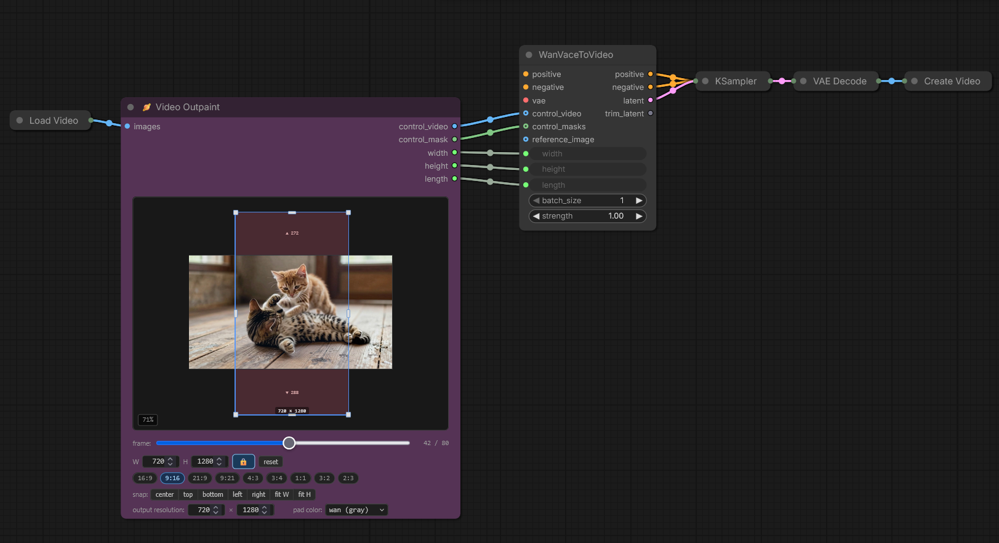
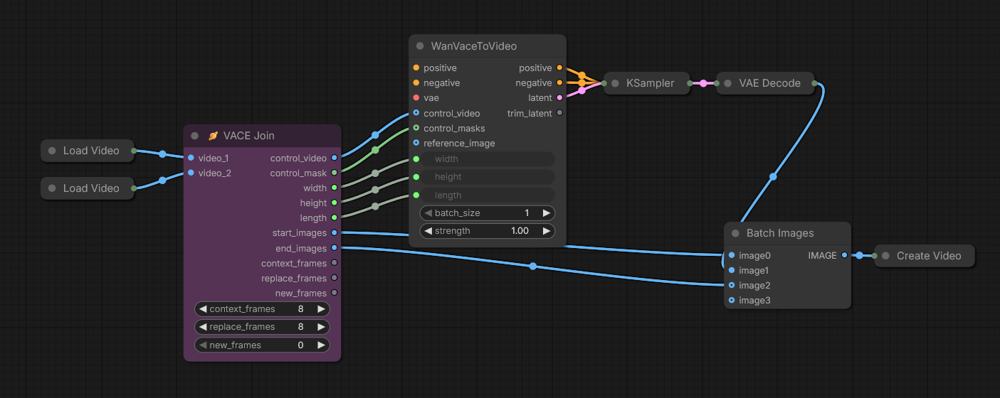
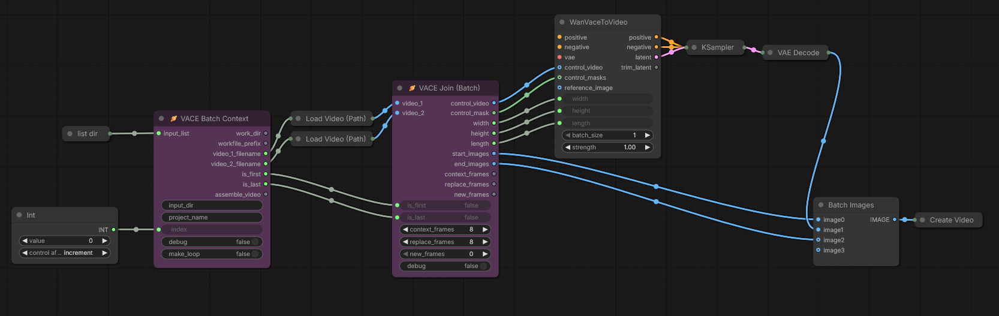
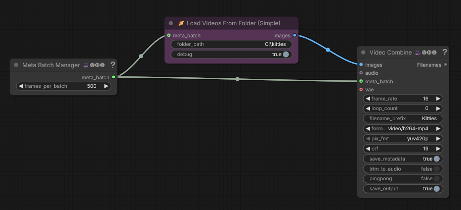

# Wan VACE Prep

A small collection of ComfyUI nodes for common video tasks. Primarily designed for Wan VACE, with LTX-2 outpainting support.

## Quick Start

**Install via ComfyUI Manager:** Search for "Wan VACE Prep"

**Or clone this repository:**

```bash
cd /path/to/comfyui/custom_nodes
git clone https://github.com/stuttlepress/ComfyUI-Wan-VACE-Prep
```

## Nodes

- [Video Outpaint](#video-outpaint) *(formerly VACE Outpaint*)
- [VACE Join](#vace-join)
- [VACE Join (Batch)](#vace-join-batch)
- [VACE Batch Context](#vace-batch-context)
- [VACE Extend](#vace-extend)
- [Load Videos From Folder (Simple)](#load-videos-from-folder-simple)

### Video Outpaint

Prepares a video for outpainting using an interactive canvas widget. Position and size an output window over your source frames. Regions outside the source become the outpaint area. Primarily designed for VACE, with support for LTX-2 outpainting via the pad color preset.

Renamed from *VACE Outpaint*.




**Parameters:**

| Parameter | Default | Description |
|-|-|-|
| images | | Source video frames |

**Canvas controls:**

| Control | Description |
|-|-|
| output resolution | Width and height of the generated output. Leave at 0 to match the crop box size. |
| pad color | Fill color for the outpainted region of the control video. "wan" = gray (0.5), "ltx" = black (0.0), "custom" = enter a hex code (#RRGGBB), 0-255 integers (R,G,B), or 0.0-1.0 floats (R,G,B). |

**Outputs:**

| Output | Description |
|-|-|
| control_video | VACE control video input. Source content placed within the output window; overhanging regions filled with the selected pad color. |
| control_mask | VACE control mask input. White (1) where outpainting should occur, black (0) over source content. |
| width, height | Output video dimensions |
| length | Frame count |

https://github.com/user-attachments/assets/a233832a-6630-4e7b-8d05-9e048d2e97a4

---

### VACE Join	
For smoothly joining two video clips together. Builds VACE controls for the transition using context frames from each clip to guide frame generation. 



**Parameters:**

| Parameter | Default | Description |
|-|-|-|
| context_frames | 8 | Reference frames from each video edge that VACE uses for interpolation. These frames guide the model and are preserved in the output. Must be a multiple of 4. |
| replace_frames | 8 | Number of frames at each transition edge to discard and regenerate. These create the actual transition blend zone. Must be a multiple of 4. |
| new_frames | 0 | Number of completely new frames to generate between the two clips, extending the transition duration. Must be 0 or a multiple of 4. |

**Outputs:**

| Output | Description |
|-|-|
| control_video | VACE control video input |
| control_mask | VACE control mask input |
| width, height, length | Control video dimensions |
| start_images | Video 1 segment that precedes context frames and the transition |
| end_images | Video 2 segment that comes after the transition and context frames |
| context_frames, replace_frames, new_frames | Parameter passthrough for optional downstream wiring |


https://github.com/user-attachments/assets/5b70b5af-8d88-4c0f-a5a7-cdbe0657ce8c


---

### VACE Join (Batch)

Batch-aware version of VACE Join for processing multiple video pairs. Handles first/last iteration edge cases.



**Parameters:**

| Parameter | Default | Description |
|-|-|-|
| video_1 | | First video in the pair (IMAGE type) |
| video_2 | | Second video in the pair (IMAGE type) |
| is_first | false | Set true for first iteration (index=0). Includes full beginning of video_1 in start_images |
| is_last | false | Set true for last iteration. Includes full ending of video_2 in end_images |
| context_frames | 8 | Reference frames from each video edge for VACE interpolation. Must be a multiple of 4. |
| replace_frames | 8 | Frames at each transition edge to discard and regenerate. Must be a multiple of 4. |
| new_frames | 0 | New frames to generate between clips. Must be 0 or a multiple of 4. |
| debug | false | Log diagnostic information to the console |

**Outputs:**

| Output | Description |
|-|-|
| control_video | VACE control video input (context frames + placeholder for generation) |
| control_mask | VACE control mask input (masks generation region) |
| width, height, length | Control video dimensions |
| start_images | Video segment from video_1 to preserve (excludes transition region) |
| end_images | Video segment from video_2 to preserve (only populated on last iteration) |
| context_frames, replace_frames, new_frames | Parameter passthrough for optional downstream wiring |

---

### VACE Batch Context

*This node drives my [Wan VACE Video Joiner](https://github.com/stuttlepress/ComfyUI-Wan-VACE-Video-Joiner) workflow. It may not be useful outside of that context.*  
Establishes iteration context for batch video processing workflows. Manages file paths, iteration tracking, and provides first/last flags for proper handling of video sequence boundaries. Supports an optional loop mode that generates a wrap-around transition between the last and first video for seamless looping output.


**Parameters:**

| Parameter | Default | Description |
|-|-|-|
| input_list | | List of video filenames to process (STRING, force input) |
| input_dir | | Directory containing input videos |
| project_name | . | Workflow files are created under ComfyUI/output/project_name. Use period (.) for no project name. |
| index | 0 | Current iteration index (0-based). Valid range: 0 to (number of videos - 2) normally, or 0 to (number of videos - 1) when `make_loop=true` |
| debug | false | Log iteration details to the console |
| make_loop | false | Enable loop mode. Adds one extra iteration that pairs the last video with the first, creating a seamless loop. When true, `is_first` and `is_last` are always false. |

**Outputs:**

| Output | Description |
|-|-|
| work_dir | Working directory path for intermediate files |
| workfile_prefix | Filename prefix for this iteration's work files |
| video_1_filename | Full path to first video in current pair |
| video_2_filename | Full path to second video in current pair |
| is_first | True if this is the first iteration (index=0). Always false when `make_loop=true`. |
| is_last | True if this is the last iteration. Always false when `make_loop=true`. |
| assemble_video | True on the final iteration. Used to gate the assembly step. Equivalent to `is_last` when `make_loop=false`; fires on the loop-closing iteration when `make_loop=true`. |

---

### VACE Extend

Extends a video from an arbitrary frame position. Context frames preceding the extension point build a VACE control video for conditioning.


**Parameters:**

| Parameter | Default | Description |
|-|-|-|
| extend_from_idx | -1 | Frame to extend from (negative counts from end, e.g., -1 = last frame) |
| context_frames | 8 | Reference frames preceding extend_from_idx for VACE conditioning. Must be a multiple of 4. |
| new_frames | 25 | Number of new frames to generate (must be 4n+1: 1, 5, 9, 13, 17, 21, 25...) |

**Outputs:**

| Output | Description |
|-|-|
| control_video | VACE control video input |
| control_mask | VACE control mask input |
| width, height, length | Control video dimensions |
| start_images | Video segment that precedes the context frames and the extension |
| context_frames, new_frames | Parameter passthrough for downstream wiring |

---

### Load Videos From Folder (Simple)

Loads all videos from a folder, concatenated into a single image batch.

Optionally connect a **[VideoHelperSuite](https://github.com/Kosinkadink/ComfyUI-VideoHelperSuite)** *Meta Batch Manager* node to process large collections in RAM-safe chunks. If you are joining a large number of video files and running out of system memory as they concatenate, this is the solution. From the VHS Meta Batch Manager node documentation:

> The Meta Batch Manager allows for extremely long input videos to be processed when all other methods for fitting the content in RAM fail. It does not affect VRAM usage. It must be connected to at least one Input (a Load Video or Load Images) AND at least one Video Combine.

See the VHS Meta Batch Manager node documentation for more information.

*Meta Batch Manager* rule of thumb: set `frames_per_batch` to roughly 10× your available RAM (not VRAM) in GB. So 32 GB -> 320 frames, 64 GB -> 640 frames, 128 GB -> 1280 frames.

- **Formats:** webm, mp4, mkv, gif, mov
- All videos must have identical resolution
- No external dependencies



**Parameters:**

| Parameter | Default | Description |
|-|-|-|
| folder_path | | Full pathname of the directory holding input videos |
| debug | false | Log video details and progress to the console |
| meta_batch | *(optional)* | Connect to VideoHelperSuite Meta Batch Manager to load videos in batches |

**Outputs:**

| Output | Description |
|-|-|
| images | Concatenated image batch ready for video creation |

---
## Experimental

Stuff here is new and has not been thoroughly tested. Inputs, outputs, and behavior may change in future releases without notice.

### Wan VACE Inpaint

Prepares control video and mask for inpainting. Connect the output to `WanVaceToVideo.control_video` / `control_masks`; use `WanVaceToVideo.reference_image` separately if you need a reference frame.

**Parameters:**

| Parameter | Default | Description |
|-|-|-|
| video | | Source video frames (IMAGE) |
| mask | | Inpaint mask. White (1) marks regions to regenerate, black (0) preserves the original. Can be a single frame (broadcast to all frames) or a per-frame sequence. |

**Outputs:**

| Output | Description |
|-|-|
| control_video | VACE control video input. Masked pixels replaced with gray (0.5). |
| control_mask | VACE control mask input. White (1) where inpainting should occur, black (0) over preserved content. |
| width, height | Video dimensions (must be divisible by 16) |
| length | Frame count (matches input video) |

---

### Frame Number Overlay

Burns a frame number label into every frame of an IMAGE batch as a text overlay. Useful for identifying frames in long sequences or debugging video workflows.

**Parameters:**

| Parameter | Default | Description |
|-|-|-|
| images | | Input image batch (IMAGE) |
| font_size | 32 | Size of the overlay text (8–256) |
| start_index | 0 | Starting frame number for the first frame in the batch |
| position | top-left | Placement: top-left, top-right, bottom-left, or bottom-right |
| padding | 10 | Distance from edge in pixels |
| font_color | white | Text color (any CSS color name or hex) |
| prefix | "" | Optional text before the frame number |
| suffix | "" | Optional text after the frame number |

**Outputs:**

| Output | Description |
|-|-|
| images | Image batch with frame numbers burned in |

---

### Wan First/Last/Middle Frame to Video

Based on native ComfyUI WanFirstLastFrameToVideo, generates conditioning latents from optional start, end, and middle reference images using a VAE and clip vision model. 

**Parameters:**

| Parameter | Default | Description |
|-|-|-|
| positive | | Positive conditioning |
| negative | | Negative conditioning |
| vae | | VAE for latent encoding/decoding |
| width | 832 | Output width (multiple of 16) |
| height | 480 | Output height (multiple of 16) |
| length | 81 | Frame count (4n+1 pattern) |
| batch_size | 1 | Number of parallel generations |
| start_image | *(optional)* | Reference image for the beginning frames |
| end_image | *(optional)* | Reference image for the ending frames |
| middle_image | *(optional)* | Reference image for middle frames |
| middle_frame | 0.5 | Position of middle reference as fraction of total length |
| clip_vision_start_image | *(optional)* | CLIP vision output for start image guidance |
| clip_vision_end_image | *(optional)* | CLIP vision output for end image guidance |
| clip_vision_middle_image | *(optional)* | CLIP vision output for middle image guidance |

**Outputs:**

| Output | Description |
|-|-|
| positive | Positive conditioning with frame-level guidance |
| negative | Negative conditioning |
| latent | Generated latent video tensor |

---

### VACE First/Middle/Last

Builds a VACE control video and mask from optional first, middle, and last frame batches. Known frames are placed at their positions with mask=0; remaining frames become gray placeholders (mask=1) for Wan to generate. I have found VACE FLF2V and FMLF2V to be far less effective than conditioning-based versions. VACE-generated motion tends to be very linear, unnatural when applied to people, except for very short sequences.

**Parameters:**

| Parameter | Default | Description |
|-|-|-|
| width | 832 | Output width (snapped to 16px grid if needed) |
| height | 480 | Output height (snapped to 16px grid if needed) |
| length | 81 | Total frame count (must follow 4n+1 pattern; snapped if not) |
| middle_position | 0.5 | Where middle frames are centered as a fraction of total length |
| first | *(optional)* | Reference frames for the beginning |
| middle | *(optional)* | Reference frames for the middle region |
| last | *(optional)* | Reference frames for the ending |

**Outputs:**

| Output | Description |
|-|-|
| control_video | VACE control video (known frames + gray placeholders) |
| control_mask | VACE control mask (0 over known regions, 1 over generation zones) |
| width, height, length | Final snapped dimensions and frame count |

---

## Technical Notes

**4n+1 frame rule.** The Wan model generates 4n+1 frames at a time. If you request a different count, it silently rounds down to the nearest 4n+1. For this reason, parameters are restricted to multiples of 4 or 4n+1, and when necessary the nodes add +1 to the generated frame count.

**Class names vs. display names.** Some internal class names (e.g., `WanVACEPrep`) don't match the current display names (e.g., "VACE Join"). This is intentional: renaming classes would break existing workflows that reference them. Once ComfyUI's node renaming API is stable, a refactoring pass will align them.

**Nodes 2.0 renderer.** These nodes have not been tested under ComfyUI's Nodes 2.0 renderer and may or may not work correctly with it. Until ComfyUI publishes documentation for node developers, no effort will be spent on ensuring Nodes 2.0 compatibility or stability.

---

## License

MIT License. Feel free to use, modify, and distribute.
